# AWS Beanstalk을 이용한 성능 튜닝 시리즈

안녕하세요 이번 시간에는 AWS Beanstalk을 이용한 웹 어플리케이션 서버 성능 튜닝 시리즈를 시작합니다.  
모든 코드는 [Github](https://github.com/jojoldu/aws-beanstalk-tunning)에 있으니 참고하시면 됩니다.  
  
신규 서비스를 출시할때마다 성능 테스트와 튜닝을 꼭 진행해야합니다.  
이번에 신규 프로젝트를 준비하면서 이것저것 시도해본 내용을 샘플 예제로 정리합니다.  

## 0. 테스트 환경

테스트 환경은 아래와 같습니다.

* AWS Elastic Beanstalk
    * **t2.medium 1대**
* AWS Aurora RDS
    * AWS와 같은 클라우드 환경에 최적화
    * **r4.large**
    * [AWS Aurora 도입전에 알아야 할 몇가지 사실](https://medium.com/hbsmith/aws-aurora-%EB%8F%84%EC%9E%85%EC%97%90-%EB%8C%80%ED%95%9C-%EB%AA%87%EA%B0%80%EC%A7%80-%EC%82%AC%EC%8B%A4-45eb602bad58) 참고
* Spring Boot 2.0.3
* DataSource
    * Hikari CP
    * 설정 X (기본값)
* 사용한 쿼리
    * ```select sum(p.amount) from point p where p.user_id=?```
* Database Row
    * 1건만 들어간 상태
    * 쿼리 속도 개선은 이번 항목과 무관하기 때문에 row는 1건만 테스트합니다.
* [Pinpoint](https://github.com/naver/pinpoint)
    * 네이버에서 만든 APM (어플리케이션 모니터링)
* [nGrinder](https://github.com/naver/ngrinder)
    * 네이버에서 만든 부하 테스트 플랫폼
    * [설치가이드](https://github.com/naver/ngrinder/wiki/Installation-Guide)

사용한 스프링부트 설정은 아주 깔끔하게 비어있습니다.

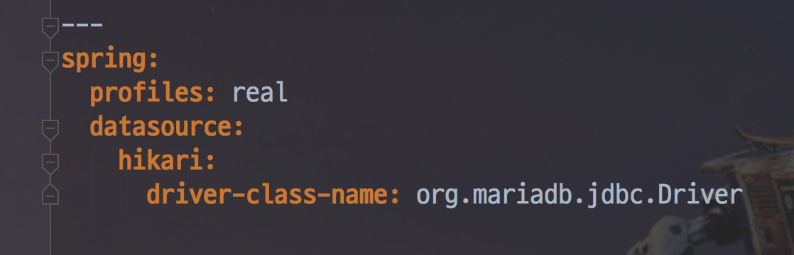

여기서부터 차례로 옵션을 추가하면서 진행할 예정입니다.

> 최소한의 설정으로 **spring.jpa.open-in-view: false** 는 합니다.  
이건 완전히 기본 세팅입니다.  
혹시나 안하신 분이 계시면 꼭 하세요

Pinpoint와 nGrinder의 설치는 이미 되어있는 상태라 가정하고 진행합니다.  

> 성능 개선에 좀 더 초점을 맞춰서 진행하겠습니다.

자 그럼 이제 성능 테스트를 시작해보겠습니다.

> 참고로 여기서 사용하는 테스트가 기준이 될 순 없습니다.  
실제로 DB에 들어간 데이터가 적고, 사용하는 쿼리가 단순하기 때문에 생각보다 훨씬 성능이 잘나옵니다.  
**성능에 문제가 있을때 어떻게 확인하고 어떻게 고치면 되는지** 대략적인 내용을 이해하시는데 초점을 맞춰주세요.  
실제 서비스에서의 TPS는 해당 하드웨어 사양으로는 실험의 1/10도 안나올때도 많습니다.  
쌓여 있는 대량의 데이터, 복잡한 쿼리, 외부 API 연동 등으로 인해 병목 요소가 굉장히 많습니다.


## 1. Datasource Connection Pool

작은 수치부터 차례로 올려보겠습니다.  

### 1-1. Vuser 20

5개의 nGrinder Agent 에서 각각 4명의 사용자를 만들어 부하 테스트를 진행합니다.  
(즉 Vuser는 5 * 4 = 20입니다.)

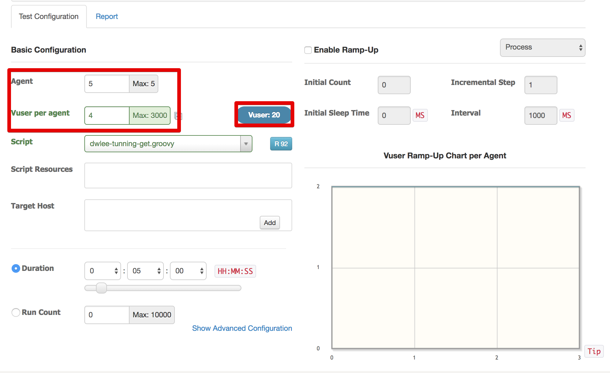

5분간 진행한 테스트 결과를 보면!

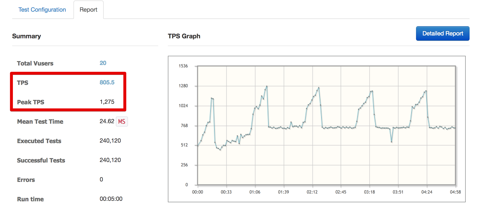

* 평균 TPS (초당 처리수): 800
* Peak TPS : 1275

> 참고로 여기서 nGrinder 수치에서 **Errors가 0**인걸 잘 보셔야합니다.  
무작정 TPS만 보시고 발생한 Errors 를 보지 않으시면 무의미한 테스트가 됩니다.  
**Errors가 0인 상황에서 TPS가 얼마나 나오는지가 중요**합니다.

Pinpoint에서 응답 상황을 봐도

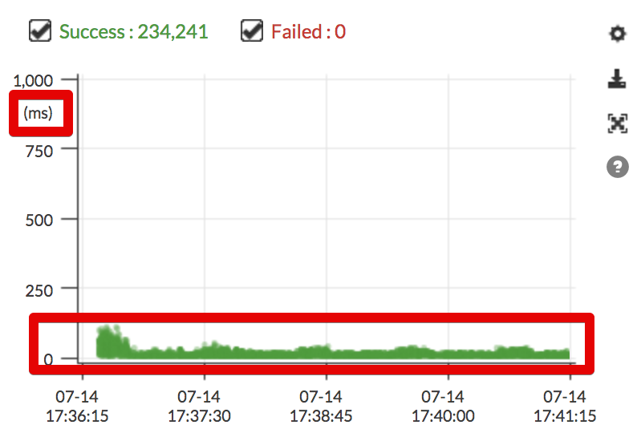

100ms (0.1초) 이내로 결과를 반환하는 것을 확인할 수 있습니다.  
  
TPS 800은 무난하게 처리가 됩니다.  
좀 더 높은 수치로 테스트 해보겠습니다.

> 동시접속자와 TPS는 전혀 다른 의미입니다.  
가끔 동접 1만을 TPS 1만처럼 이야기하시는 분들이 계시는데 전혀 다른 수치입니다.  

### 1-2. Vuser 50

자 그럼 이제 Vuser 50으로 설정 후 다시 부하 테스트를 해보겠습니다.  
Vuser 20일때 대략 TPS가 800이 나왔으니 이번에는 2배 이상을 기대해보겠습니다.  
  
5분간 부하를 넣어보면!  

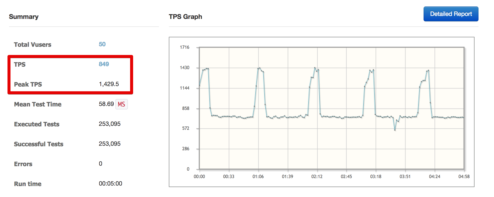

이상하게 **Vuser 20때와 비교해서 TPS가 차이가 나지 않습니다**.  
Pinpoint 그래프를 보면 더더욱 이상한 모양이 나옵니다.

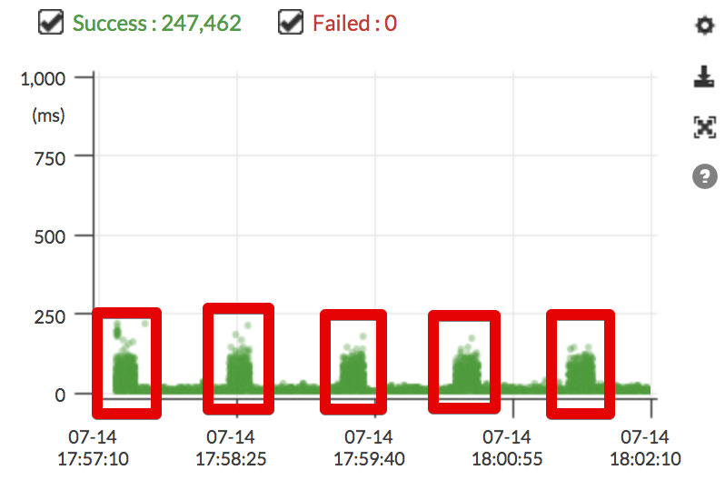

**특정 구간마다 응답 속도가 늦는 것**을 알 수 있습니다.  
자세히 살펴 보면

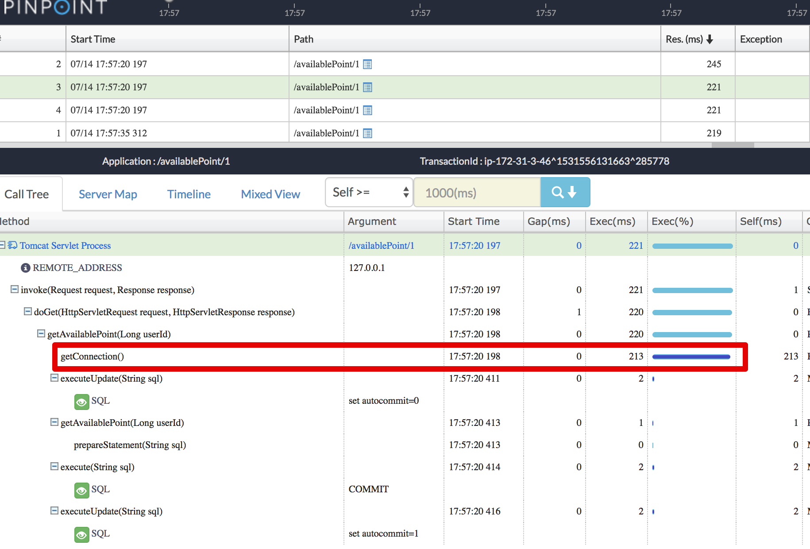

(응답이 튀는 구간)

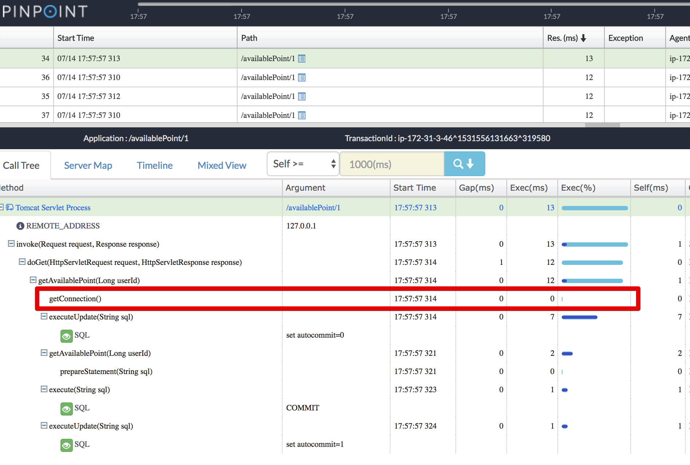

(응답이 빠른 구간)  
  
응답이 느릴때는 항상 ```getConnection()```에서 오래 걸린다는 것이 발견되었습니다!  

### 1-3. Datasource Connection Pool 설정하기

지금 문제를 보시면 **Database와 Connection을 생성하는 과정에서 병목이 발생**하는 것을 알 수 있습니다.  
Database를 사용할 때마다 Connection을 생성하고 삭제하는 과정이 필요하다보니 병목이 발생하는데요.  
이 문제를 해결할 좋은 방법은 어떤 것이 있을까요?  

아마 Spring 이나 다른 웹 프레임워크 관련된 책을 보신 분들은 바로 정답이 생각나실텐데요.  
바로 **Connection Pool**을 사용하는 것입니다.  
미리 일정량의 Connection 을 생성하고, 요청이 오면 해당 Connection을 재사용하는 방식을 얘기합니다.  
  
여기서 궁금한 것이, HikariCP와 같은 **최근의 DBCP는 기본적으로 Connection Pool을 지원**하는데 왜 이런 일이 발생했을까 입니다.  
  
힌트는 HikariCP의 코드에서 얻을 수 있습니다.  
  
HikariConfig.java의 ```setMaximumPoolSize``` 를 보시면 아래와 같은 내용이 나옵니다.

**maximum-pool-size**

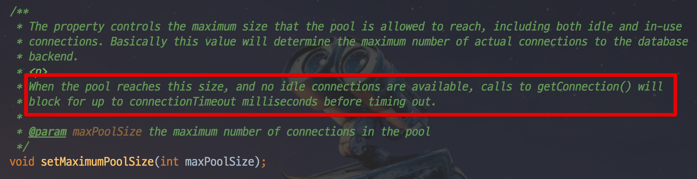

사용하는 Connection의 숫자가 maximum Pool Size에 도달하면 ```getConnection()```을 호출하고, 이때는 최대 connectionTimeout만큼 block 될 수 있다고 합니다.  
딱 저희의 상황과 같죠?  
부연설명을 하자면, HikariCP의 **기본 maximum-pool-size는 10**입니다.  
(HikariCP.DEFAULT_POOL_SIZE 참고)  
  
10을 초과하는 커넥션 요청이 오면 그만큼 ```getConnection()```을 호출하기 때문에 이와같은 상황이 발생한 것입니다.  

> 기존 다른 DBCP (Commons DBCP)에서 설정하던 max-active, max-idle의 값은 모두 maximum-pool-size에 포함되어 있습니다.  
(주석에 있는 **including both idle and in-use connections** 참고 )

스프링 부트에서는 아주 쉽게 설정이 가능하기 때문에 바로 설정해보겠습니다.  
현재 사용하는 DBCP인 [HikariCP](https://github.com/brettwooldridge/HikariCP) 에 맞춰 설정합니다.  
  
**application.yml**

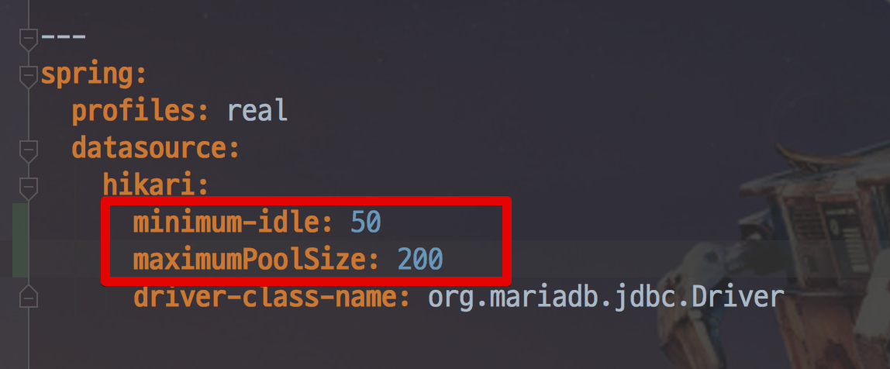

```yaml
---
spring:
  profiles: real
  datasource:
    hikari:
      maximum-pool-size: 50
      driver-class-name: org.mariadb.jdbc.Driver
```

주의하실 점은 톰캣 서버가 1대가 아닌 여러대일 경우 **서버들의 maximum-pool-size의 합이 RDS의 max connection 수를 초과**하면 안됩니다.  
RDS는 별다른 설정이 없다면 RDS 사양에 따라 다음과 같은 max_connection값을 가집니다.

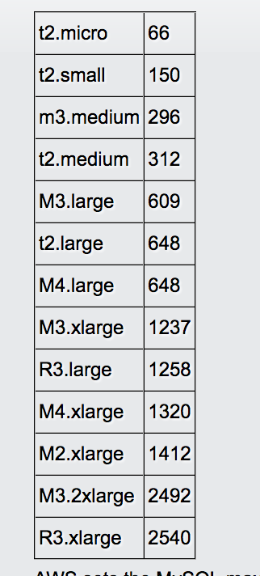

([출처](http://tritoneco.com/2015/11/23/max_connections-at-aws-rds-mysql-instance-sizes/))

서버가 여러대라 RDS max_connection 값이 초과하지 않도록 주의해주셔야 합니다.  

> RDS 파라미터 그룹을 통해서 저 수치를 증가시킬수 있으니 참고하세요!

추가로 궁금한것이 **minimum-idle 수치는 조정하지 않아도 되는건가?** 입니다.

**minimum-idle**

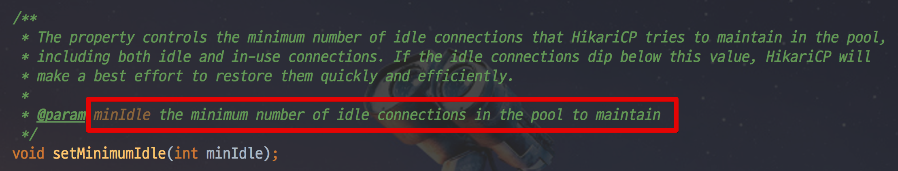

minimum-idle의 설명을 보면 Connection Pool의 최소 유지수 라고 합니다.  
즉, 사용하지 않을때도 최소한 이정도의 Connection은 유지한다는 뜻입니다.  
HikariCP에서는 이 값을 설정하지 않을 경우 **maximum-pool-size와 일치**시킵니다.  
그래서 별다른 설정을 하지 않겠습니다.
  
> Connection Pool에 대해 좀 더 자세하게 알고 싶으신 분들은 [Naver D2 - Commons DBCP 이해하기](https://d2.naver.com/helloworld/5102792) 을 참고해보세요!

설정하신후 배포를 해보시면 **RDS의 커넥션 수가 10 -> 50**으로 변경된 것을 확인할 수 있습니다.  

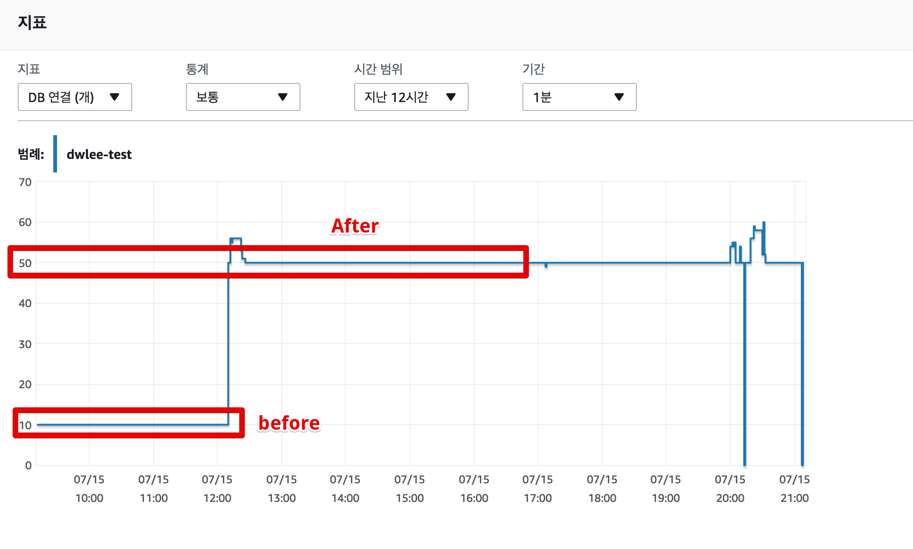

배포하자마자 RDS의 활성화된 Connection 수가 50으로 바로 증가한걸 보면 maximum-pool-size 값이 minimum-idle에 똑같이 적용되었다는 것을 알 수 있죠?  
  

자 그럼 다시 한번 테스트를 해보겠습니다.  
Pinpoint에 더이상 주기적으로 튀는 것은 없어졌지만!  
**테스트 초반에 응답 속도가 확 튀는 것**이 보입니다.

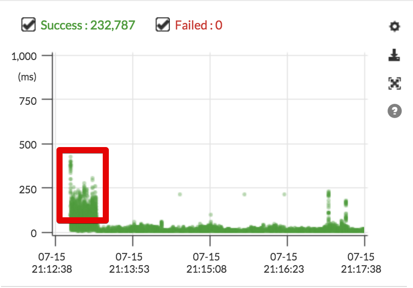

RDS의 CPU는 25% 까지만 올라갔기 때문에 아직 여유가 있습니다.

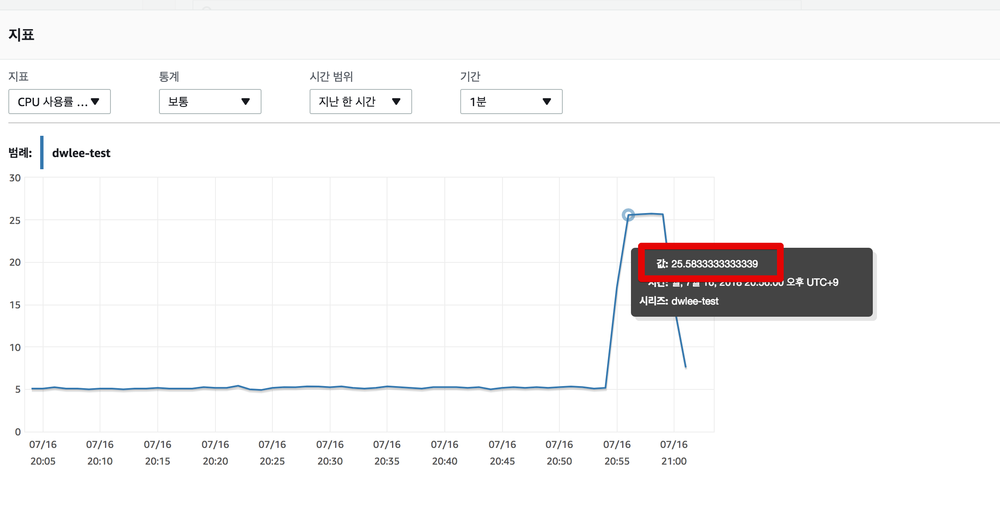

하지만! Beanstalk의 **EC2 CPU를 보면 100%** 까지 올라갔습니다!

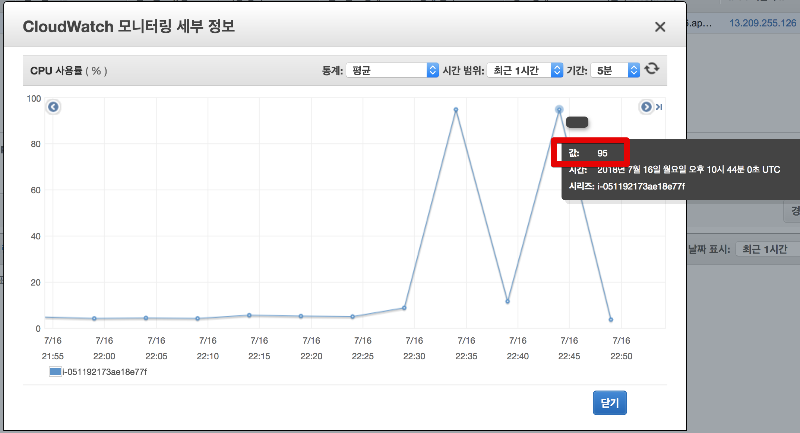

더 중요한건 **TPS가 증가하지 않았습니다!**

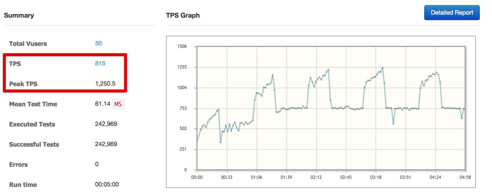

또 뭔가 문제가 있어보입니다.  
RDS의 CPU에는 여유가 있지만, EC2의 CPU가 따라가지 못하고 있습니다.  
자 그러면 왜 EC2 의 CPU가 못따라가는지 쓰레드 덤프를 통해서 확인해보겠습니다.

