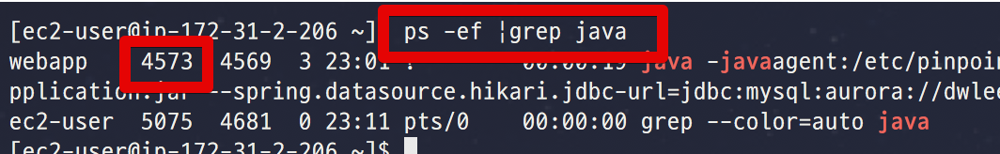

# 2. jstack으로 쓰레드 덤프하기



```bash
sh jstackSeries.sh 4573 10 1
```

* ```sh jstackSeries.sh [pid] [요청수] [반복주기]```

* [Eclipse.org](http://wiki.eclipse.org/How_to_report_a_deadlock#jstackSeries_--_jstack_sampling_in_fixed_time_intervals_.28tested_on_Linux.29) 