# 2. Linux Kernal 파라미터 튜닝

지난 시간에 Nginx에 엄청난 양의 에러로그가 발생하면서 부하 테스트가 강제 종료되었습니다!

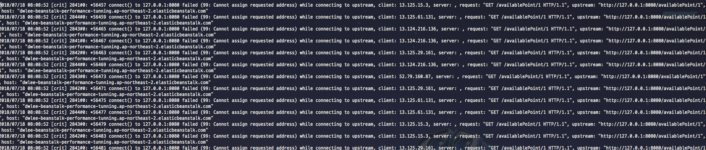

(Nginx log)  
  
이번 시간엔 해당 문제를 해결하는 과정을 진행하겠습니다.

## 2-1. TIME_OUT과 소켓

로그를 자세히 보면 아래와 같습니다.

```bash
2018/07/19 08:03:23 [crit] 2872#0: *338613 connect() to 127.0.0.1:8080 failed (99: Cannot assign requested address) while connecting to upstream, client: 13.125.61.131, server: , request: "GET /availablePoint/1 HTTP/1.1", upstream: "http://127.0.0.1:8080/availablePoint/1", host: "dwlee-beanstalk-performance-tunning.ap-northeast-2.elasticbeanstalk.com"
```

**Nginx가 8080 포트로 연결하는 과정에서 문제가 발생**했다는걸 어렴풋이 알 수 있습니다.
  
자 그럼 네트워크 소켓 상태를 확인해보겠습니다.  
아래 명령어로 확인해봅니다.

```bash
ss -s
```

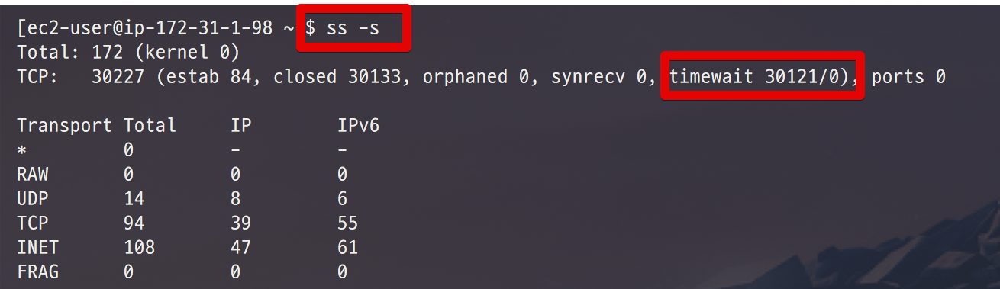

**timewait 소켓이 3만개**나 됩니다!  
어떤 소켓들인지 좀 더 자세히 보겠습니다.

```bash
netstat -napo | grep -i time_wait
```

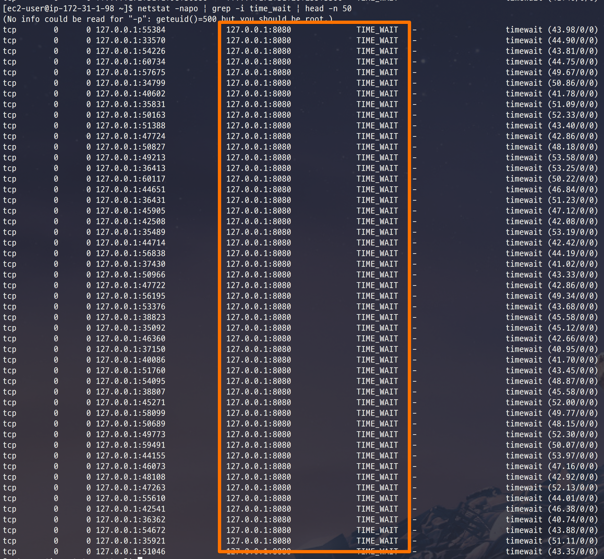

8080 포트가 목적지인 timeout 소켓들이 보이네요??  
실제로 몇개나 되는지 한번 확인해보겠습니다.

```bash
netstat -napo | grep -ic 8080
```

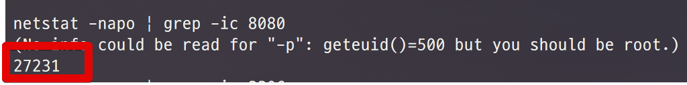

27000개!  
즉, 대부분의 timewait 소켓들이 **목적지가 8080 포트인 소켓**들입니다!  

## 2-2. Local Port 고갈 문제

대부분의 서비스는 여러 외부 서비스와 연동해서 사용됩니다.  

* Tomcat 서버와 DB가 연동되기도 하고
* Tomcat 서버와 외부 API가 연동되기도 하고
* Nginx와 Tomcat이 연동되기도 하는 등

다양한 방식으로 연동되고 사용됩니다.  
어느쪽이든 Client 입장 (요청하는 쪽)에선 **요청을 보내기 위해 커널에서 할당 받은 로컬 포트로 소켓 생성을 요청**합니다.  

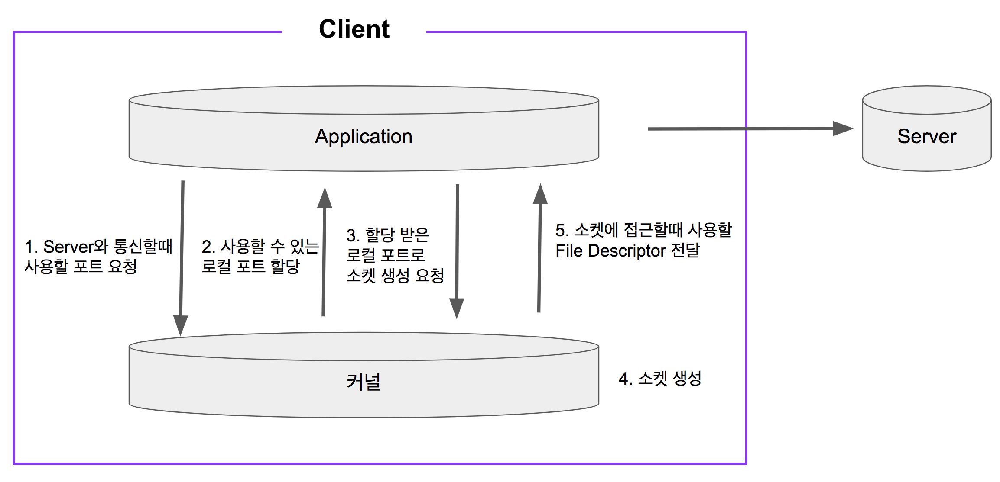

> 여기에서 얘기하는 Client는 사용자가 될수도 있고, 외부 API들이 될수도 있습니다.  
결국 요청하는 쪽을 Client, 요청을 받는 쪽을 Server라고 보시면 됩니다.  
만약 서버와 DB간에 네트워크 통신이 발생하면 서버가 Client가 되고, DB가 Server가 됩니다.


**time_wait 소켓은 time_wait가 풀려서 다시 커널로 돌아갈때까지는 사용할 수 없습니다**.  
이런식으로 대량의 로컬 포트가 time_wait 상태로 쌓이고 더이상 사용할 수 있는 포트가 없어지면 외부와 통신할 수 없게 되는 것입니다.  

알아두셔야할 점은 **출발지 IP, 출발지 Port, 목적지 IP, 목적지 Port는 커널에서 유일하게 존재**합니다.

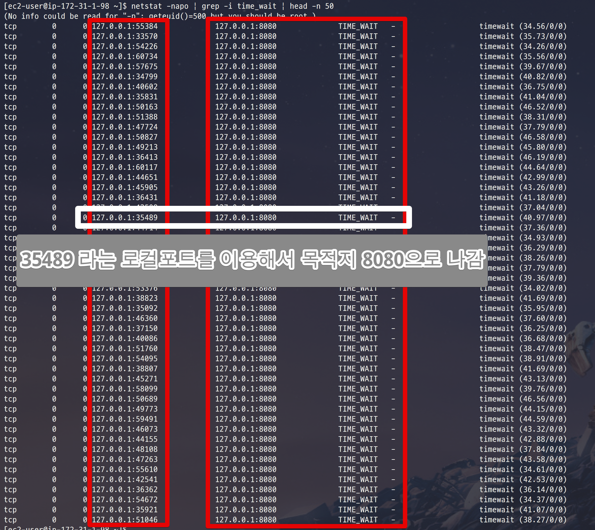

위 그림처럼 

* 출발지 IP: 127.0.0.1
* 출발지 Port: 35489
* 목적지 IP: 127.0.0.1
* 목적지 Port: 8080

을 가진 소켓은 이 서버에선 단 하나만 있다는 것입니다.  
그래서 중복 생성이 안되기 때문에 빠른 속도로 로컬 포트가 고갈되는 것입니다.  
  

  
여기서 재밌는 것은 **time_wait는 서버에서 발생하는 것이 아니라 클라이언트에서 발생**합니다.  
즉, 요청하는 쪽에 항상 time_wait 소켓이 생성되는데요.  
그럼 여기선 왜 요청을 받는 Beanstalk 서버에 time_wait이 생겼을까 궁금할 수 있습니다.  
그건 바로 **Beanstalk 서버에 Nginx가 있기 때문**인데요.  
사용자가 요청이 오면 Nginx가 그 요청을 받아 다시 스프링부트로 실행된 Tomcat (Port: 8080) 으로 요청을 보냅니다.  
이 과정에서 Nginx 는 Client가 되고, Tomcat은 Server가 됩니다.

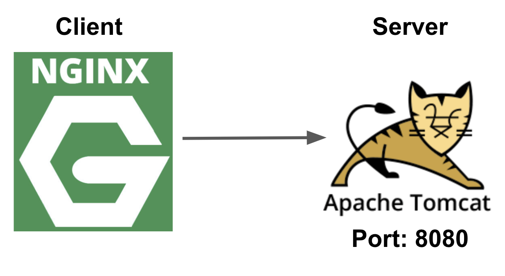

로그를 보시면 Nginx의 error.log에 포트 고갈 에러가 남은것이 그 이유 때문입니다.  

결국 Nginx가 Tomcat (Spring Boot의 내장 톰캣)에 요청하는 과정에서 로컬 포트가 모두 고갈 되버린 것입니다.  
  
자 그럼 이제 이 문제를 어떻게 해결 하면 될까요?

## 2-3. TIME_WAIT 문제 해결

### 2-3-1. Local Port 범위 증가

가장 먼저 해야할 해결책은 로컬 포트의 범위를 증가시키는 것입니다.  
물리 서버나 EC2를 사용중이시라면 아래 명령어로 로컬 포트의 범위를 증가시킵니다.

```bash
echo "10240 65535" > /proc/sys/net/ipv4/ip_local_port_range
```

만약 root 계정이 아니라면 아래 명령어로 하시면 됩니다.

```bash
echo "10240 65535" | sudo tee -a /proc/sys/net/ipv4/ip_local_port_range
```

사용하시면

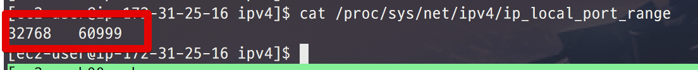

32768 ~ 60999 였던 로컬 포트 범위가

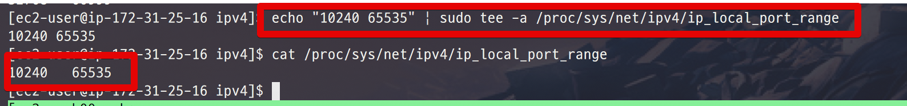

10240 ~ 65535로 증가한 것을 확인할 수 있습니다.  
  
하지만! 이렇게만 하면 근본적인 문제가 해결되진 않습니다.  
결국 **이 이상의 요청이 오면 또다시 로컬 포트의 고갈 문제로 장애가 발생**하게 됩니다.  
그래서 추가 작업을 필요합니다.

### 2-3-2. Local Port 재사용

앞시간에서 진행했던 [1장. DB Connection Pool](http://jojoldu.tistory.com/318)이 기억나시나요?  
한번 만들어진 Connection을 재사용함으로써 성능 향상을 경험할 수 있었는데요.  
마찬가지로 **time_wait된 소켓을 처리할때 대기하지 않고, 바로 재사용**하면 이 문제를 해결할 수 있게 됩니다!  
  
커널 파라미터 중, ```net.ipv4.tcp_tw_reuse```는 외부로 요청할 때 time_wait 소켓을 재사용하도록 해줍니다.  

아래 명령어 역시 root 권한으로만 가능하기 때문에 ```sudo```를 통해 진행합니다.

```bash
sudo sysctl -w "net.ipv4.tcp_timestamps=1"
sudo sysctl -w "net.ipv4.tcp_tw_reuse=1"
```

> net.ipv4.tcp_tw_reuse는 항상 net.ipv4.tcp_timestamps와 함께 사용되어야하고, **net.ipv4.tcp_timestamps는 반드시 1**이어야만 합니다.

자 이렇게 커널 파라미터 튜닝이 끝났으니 다시 한번 테스트 해보겠습니다!

### 2-3-3. 튜닝 후 성능 테스트

다시 한번 Vuser 30으로 테스트를 시작하겠습니다.  
그러면!

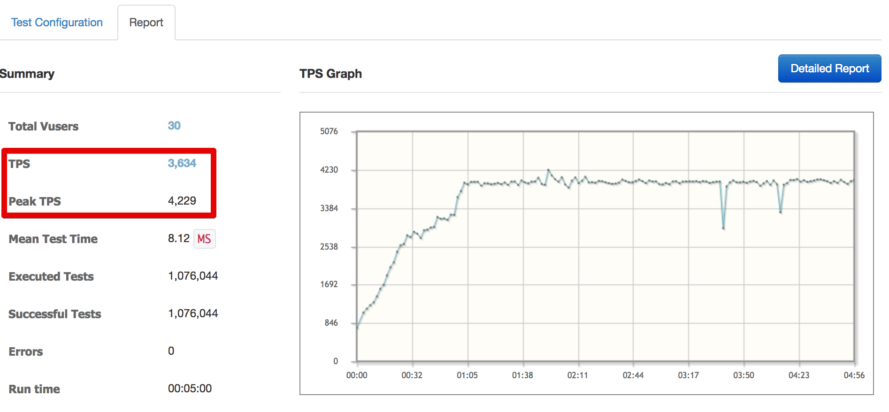

TPS 3600이 나왔습니다!  
Pinpoint를 볼까요?

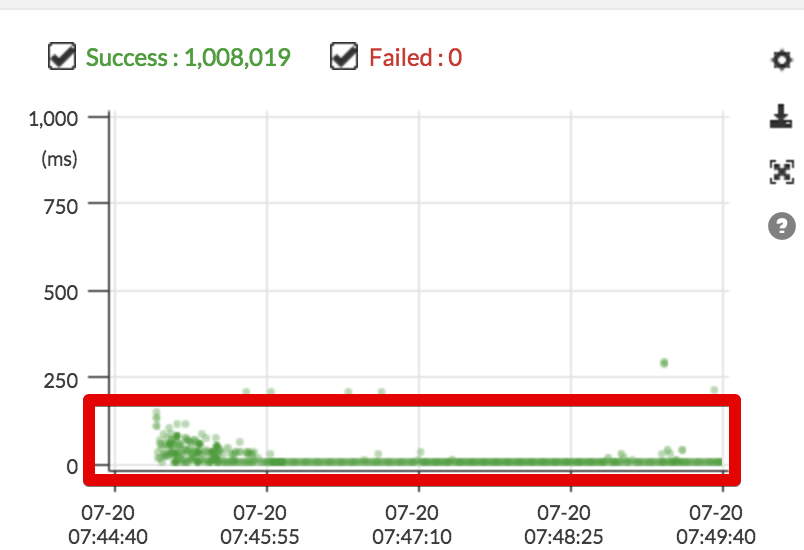

200ms (0.2초) 이내로 안정적인 성능을 보여주고 있습니다!  

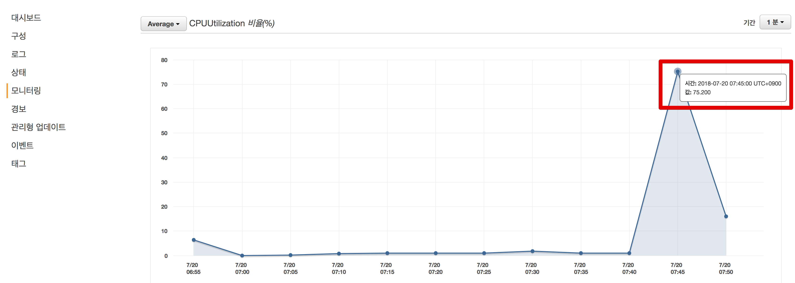

EC2의 CPU도 75% 까지 올라갔지만, 서버가 다운될만큼의 수치는 아닙니다.  
튜닝이 성공적으로 되었음을 알 수 있습니다!

## 2-3. Beanstalk Config에 적용

자 위에 했던 설정들은 모두 직접 작업을 했었는데요.  
Beanstalk 환경에선 언제든지 오토 스케일링으로 새로운 서버가 생성되기도 하고, 잘못 빌드된 파일로 인해 Beanstalk 환경 자체를 다시 빌드해야할 때도 있습니다.  
즉, 서버 하나하나에 접속해서 해당 설정을 적용하기가 어렵습니다.  
하지만! Beanstalk은 이런 어려움을 해결하기 위해 별도의 Config 방법을 지원합니다.  
  
그럼 위에서 진행한 설정을 언제든지 Beanstalk 환경이 재시작해도 적용될 수 있도록 작업해보겠습니다.  

### 2-3-1. 커널파라미터 초기화

먼저 Beanstalk의 환경을 재빌드 해서 커널파라미터 수정한것을 초기화합니다.

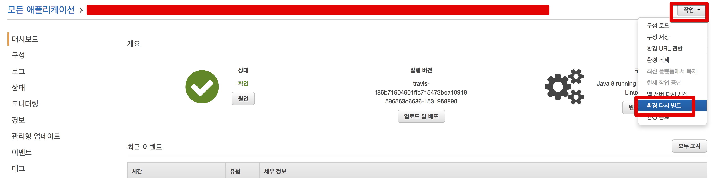

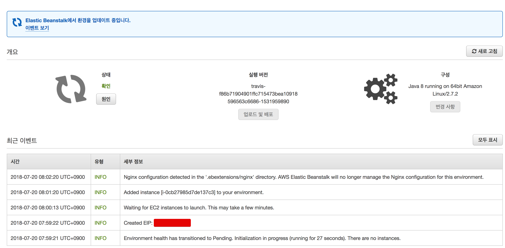

재빌드하고나서 다시 Beanstalk의 EC2로 접속해서 확인해보시면

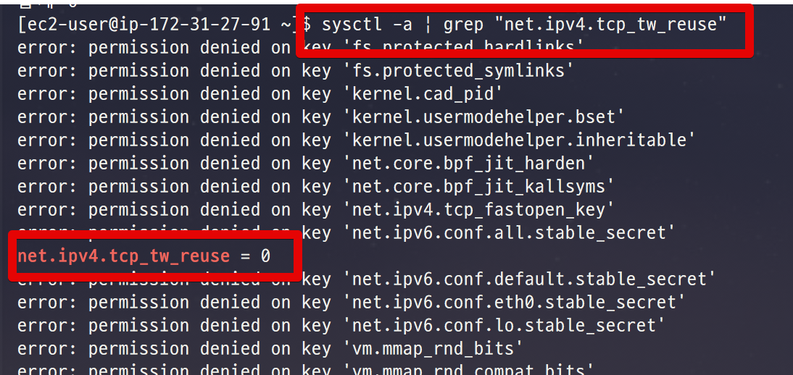

2-2에서 설정했던 튜닝 설정이 다 초기화 된 것을 알 수 있습니다.

```bash
sysctl -a | grep "net.ipv4.tcp_tw_reuse"
```

### 2-3-2. Beanstalk Config 파일 생성

프로젝트 폴더 아래에 ```.ebextensions``` 디렉토리를 생성합니다.  
그리고 그 아래에 ```00-system-tuning.config``` 파일을 생성합니다.


그리고 아래 코드를 그대로 복사해서 넣습니다.

```
commands:
  01:
    command: "echo \"10240 65535\" > /proc/sys/net/ipv4/ip_local_port_range"
  02:
    command: "sysctl -w \"net.ipv4.tcp_timestamps=1\""
  03:
    command: "sysctl -w \"net.ipv4.tcp_tw_reuse=1\""
```

> .ebextensions에 대한 좀 더 상세한 설명은 [우아한형제들 기술 블로그 - Elastic Beanstalk Configuration files](http://woowabros.github.io/woowabros/2017/08/07/ebextension.html)를 참고해보세요!

위에서 적용했던 커널파라미터 수정을 모두 ```00-system-tuning.config```에 추가하였습니다.  
이제 Beanstalk이 배포될때마다 해당 설정을 적용할 것입니다!  

자 그럼 잘 적용되었는지 한번 확인해보겠습니다.  
다시 배포를 해보시고, 해당 EC2에 접속합니다.  
설정값을 확인해보시면!

```bash
sysctl -a | grep "net.ipv4.tcp_tw_reuse"
```

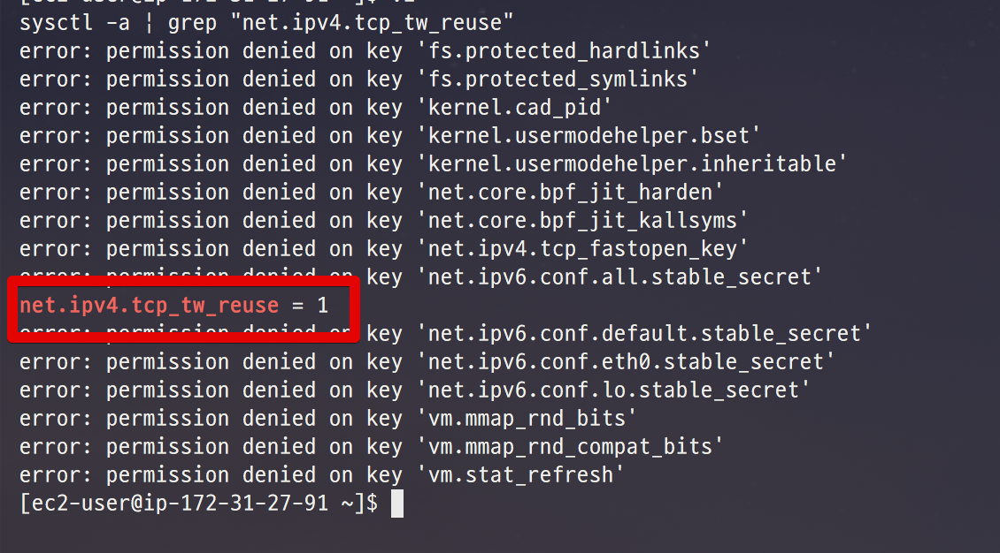

별다른 설정없이 **배포만 했는데도 커널파라미터가 튜닝**되었습니다!  
  
이제 커널 파라미터 설정에 대한 걱정없이 배포만 하시면 항상 최상의 튜닝 상태가 유지될 것입니다.  
  
이번 시간에는 리눅스 관련된 내용이 많아서 어려우실수도 있습니다.  
하지만 백엔드 엔지니어로 가실려면 꼭 알고 가셔야하기 때문에 이해가 안되시면 다른 자료를 꼭 참고해서라도 이해하시길 추천드립니다 :)  
  
그럼 다음 챕터에서 뵙겠습니다.  
감사합니다!


## 참고

TIME_WAIT와 소켓을 배우는데 정말 큰 도움을 준 2개를 소개합니다.

* [CLOSE_WAIT & TIME_WAIT 최종 분석](http://tech.kakao.com/2016/04/21/closewait-timewait/)
* [DevOps와 SE를 위한 리눅스 커널 이야기](https://book.naver.com/bookdb/book_detail.nhn?bid=12343450)