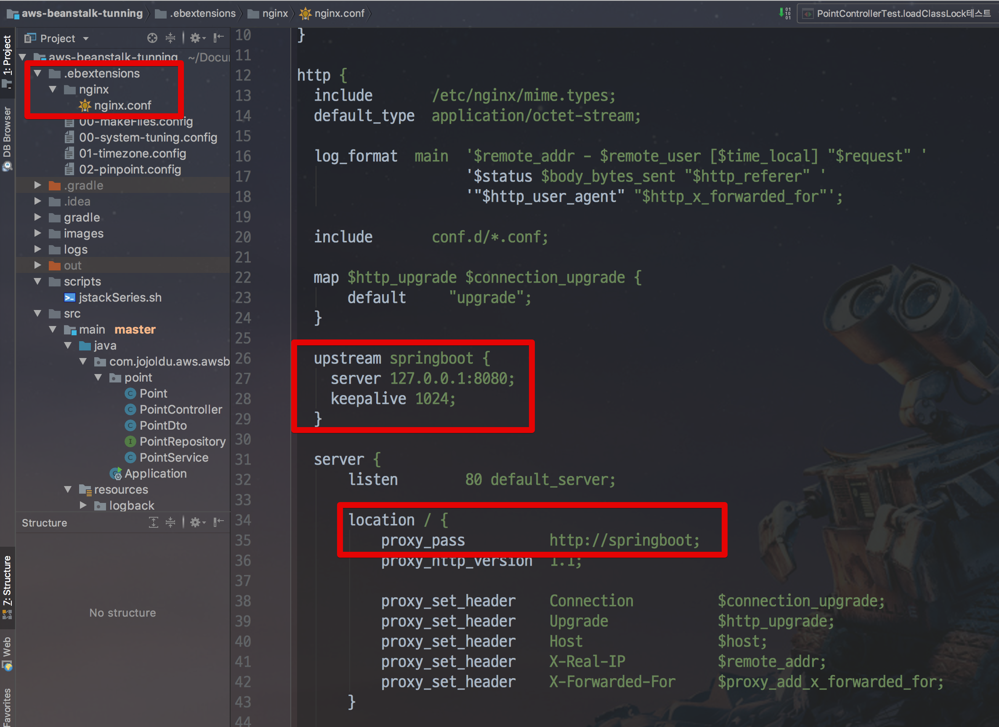
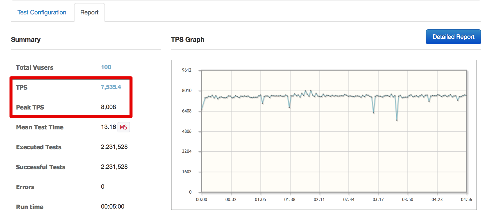
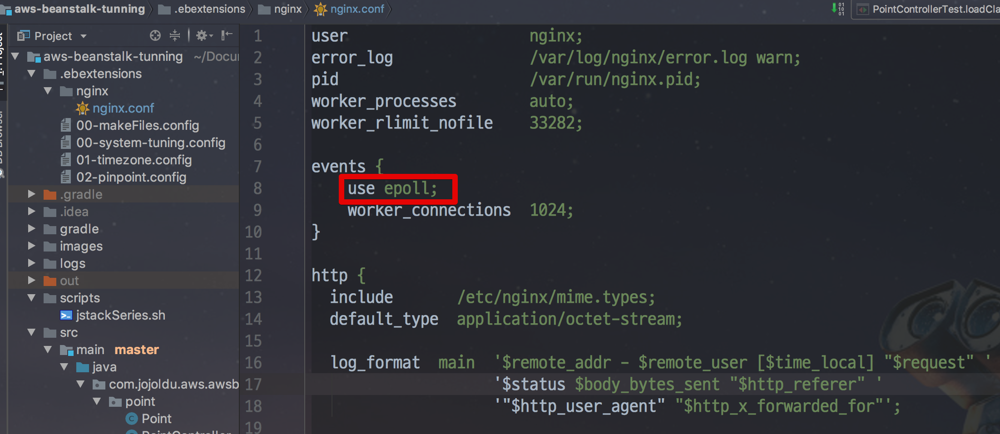
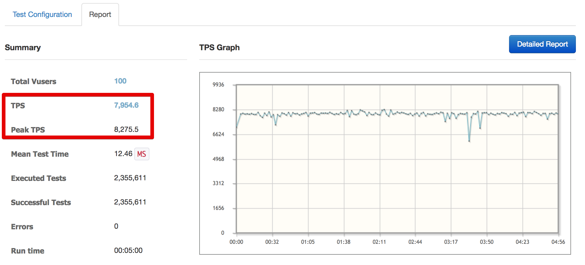

# 3. Nginx 튜닝

[지난 시간](http://jojoldu.tistory.com/319)에 보셨던것처럼 **AWS Elastic Beanstalk은 기본적으로 Nginx을 갖고 있습니다**.  
이 내용을 모르시는 분들 입장에선 성능 튜닝시 Nginx 부분은 놓치실 수 있는데요.  
그래서 이번 시간에는 Nginx와 Spring Boot 간의 성능 튜닝 과정을 진행해보겠습니다.

> 모든 코드는 [Github]()에 있습니다.

## 3-1. 여전히 많은 TIME_WAIT 소켓

[지난 시간](http://jojoldu.tistory.com/319)에 ```net.ipv4.tcp_tw_reuse``` 값을 수정하여 로컬 포트 고갈 문제를 해결하였습니다!  
그리고 수정된 버전으로 다시 한번 성능 테스트를 진행했는데요.  
  


Vuser 50으로 맞추고 테스트를 하니 TPS가 4700까지 올라갔습니다!  
중간에 DB Connection이 부족한것이 발견되어 **DB Connection Pool Size와 Tomcat Thread를 조정** 후 다시 성능 테스트를 진행하겠습니다.  

> datasource.hikari.maximum-pool-size: 200  
server.tomcat.max-threads: 300

이번엔 Vuser 100으로 맞추었습니다.


TPS가 6300까지 증가했습니다!  
  
한번 더 성능 테스트를 하던 중 TIME_WAIT 소켓을 체크해보니,


대략 3만개의 TIME_WAIT 소켓이 생성되어 유지중 이였습니다.  
**여전히 너무 많은 TIME_WAIT 소켓이 생성**되고 있습니다.  

TIME_WAIT 소켓을 재사용함으로써 로컬 포트 고갈 문제가 해결되었지만, 근본적인 문제가 남아있었습니다.  
**애초에 TIME_WAIT 소켓이 쌓이지 않도록** 문제를 해결해보겠습니다.

## 3-2. Nginx Keepalive

웹 서버 (Nginx)와 웹 어플리케이션 서버 (Tomcat/SpringBoot) 간의 요청 역시 **TCP 통신이기 때문에 TCP handshake를 합니다**.  
별다른 설정 없는 상태라면, **한번의 요청만 처리한뒤 소켓이 끊어져 TIME_WAIT 소켓**으로 남게 됩니다.  
TIME_WAIT 소켓이 대량 생산됨으로써 로컬 포트 고갈 문제가 발생하는 것은 이전 시간에 해결하였지만, 더 큰 문제는 **서비스 응답 지연이 발생**할 수 있다는 것입니다.  
  
**모든 요청에 TCP handshake가 발생하기 때문에 불필요한 성능 낭비**가 일어납니다.  
(물론 대규모 요청이 올때 발생하겠지만, 그것 때문에 오히려 초반에 발견하기가 더더욱 힘들 수 있습니다.)  
  
매번 요청이 올때마다 Nginx와 Tomcat 사이에 세션을 만들지 않으려면 어떻게 해야할까요?  
바로 **keepalive**가 필요합니다.  
  
keepalive는 **한번 맺은 세션을 요청이 끝나더라도 유지해주는 기능**을 얘기합니다.  
매 요청마다 새로운 세션을 만들지 않고, 지정된 숫자만큼의 세션을 연결한 뒤 그 연결을 통해 요청을 처리하게 해줍니다.  
  
그래서 저희는 Nginx의 설정에 keepalive 기능을 추가해보겠습니다.

### 3-2-1. Nginx와 Spring Boot간의 keepalive 설정

본인의 서버에 설치된 Nginx의 confing 파일 설정을 아래와 같이 변경합니다.  

> 보통 /etc/nginx/nginx.conf 위치에 있습니다


```
  map $http_upgrade $connection_upgrade {
      default     "upgrade";
  }

  upstream springboot {
    server 127.0.0.1:8080;
    keepalive 1024;
  }

  server {
      listen        80 default_server;

      location / {
          proxy_pass          http://springboot;
          proxy_http_version  1.1;
          proxy_set_header    Connection          $connection_upgrade;
          proxy_set_header    Upgrade             $http_upgrade;

          ...
      }
      ...
  }
```

> 참고: [Nginx WebSocket Proxying](http://nginx.org/en/docs/http/websocket.html)

* ```upstream springboot```
    * springboot라는 upstream 설정을 생성합니다.
    * springboot라는 이름의 upstream을 사용하려면 location의 proxy_pass에 ```http://upstream이름```으로 지정하시면 됩니다.
* ```proxy_XXX```
    * keepalive 옵션을 적용하기 위해서 필요한 값들입니다.
* ```keepalive 1024```
    * **keepalive로 유지시키는 최대 커넥션 개수**를 얘기합니다.  
    * 1024개의 세션을 만들어 계속 재활용한다는 의미로 보시면 됩니다.  

설정이 크게 어렵지 않으시죠?  
위 설정을 Beanstalk에선 어떻게 적용하면 되는지 바로 아래에서 설명드리겠습니다.

### 3-2-2. AWS Beanstalk의 Nginx 설정하기 

AWS Beanstalk에서 Nginx의 nginx.conf 파일을 수정하는 방법은 간단합니다.  
Beanstalk은 ```.ebextensions/nginx/nginx.conf``` 파일이 있으면 그 파일을 **Beanstalk 내부의 nginx.conf 파일과 교체**합니다.

> Beanstalk 배포시에 .ebextensions 디렉토리와 jar 를 포함시키는게 어려우신 분들은 [이전에 작성된 포스팅](http://jojoldu.tistory.com/317)을 참고해보세요!

그래서 아래와 같이 프로젝트 디렉토리 최상위에 ```.ebextensions/nginx/nginx.conf```을 생성하고, 본인의 nginx.conf 내용을 그대로 복사합니다.



자! EC2 혹은 Beanstalk의 설정이 끝나셨다면 다시 한번 테스트를 진행해보겠습니다!

### 3-2-3. 튜닝 후 테스트

3-1과 마찬가지로 Vuser 100으로 맞춰 요청해보겠습니다.  
요청 중간에 서버의 TIME_WAIT 소켓을 체크해보는데요.


평균 3만개 소켓에서 4 ~ 5000개 소켓으로 확연히 줄어든 것을 볼 수 있습니다!

> Tomcat과 DB간의 TIME_WAIT 소켓이나, 기타 다른 통신으로 인한 TIME_WAIT 소켓이 합쳐진 수치입니다.

TPS 수치도 확인해보시면!



TPS 7500까지 처리할 수 있게 되었습니다!  

## 3-3. epoll

Nginx의 keepalive를 수정하였으니, 하나 더 튜닝을 해보겠습니다.  
이번에 해볼 것은 **Nginx의 events에 epoll을 선언**하는 것입니다.  
epoll에 대해서는 다른 좋은 사이트의 설명을 번역해서 소개하겠습니다.

> 리눅스에선 모든 것이 파일이기 때문에 네트워크 연결조차 내부적으로 파일입니다.  
모든 프로세스마다 유니크한 File Descriptor가 있습니다.  
이 File Descriptor는 **어느 것이 읽거나 쓸 준비가 되었는지를 식별하기 위해 자주 Polling** 해야합니다.  
앞서 논의한 것처럼 nginx는 싱글 스레드로 Non Blocking I/O를 사용합니다.  
따라서 단일 프로세스는 어떤 연결 파일을 읽거나 쓸 준비가 되었는지 식별해야합니다.  
운영 체제에는 이를 위한 세 가지 방법 (select, poll, epoll)이 있습니다.  
select와 poll을 사용하면 **어떤 File Descriptor가 준비 되었는지를 찾기 위해 모든 File을 Polling** 합니다. 효율적인 방법이 아닙니다.  
이 두 가지 방법 모두 너무 많은 연결 수가 있을 때 효율적이지 않습니다.  
예를 들어 한 번에 10000 개의 연결을 제공한다고 가정합니다.  
그리고 그들 중 하나만 읽을 준비가 되었습니다.  
**하나의 File Descriptor가 읽을 준비가 되었음을 확인하기 위해 프로세스는 나머지 9999 File Descriptor를 계속 스캔**해야 합니다.  
select와 Poll 이외의 또 다른 방법은 **epoll**이 있습니다.  
이것은 2.6 버전 이상의 Linux 커널에서만 사용 가능합니다.  
Epoll은 select 및 poll 에 비해 효율적인 메커니즘을 사용합니다.  
서버에 10000 개의 연결이 있고 그 중 8000 개가 유휴 연결 인 경우 poll과 select를 사용하는 것은 효과적이지 않습니다.  
왜냐하면 **epoll은 활성화 된 연결에만 중요성을 부여**하기 때문입니다.  
select & poll 및 epoll은 기본적으로 같은 일을 하지만 **epoll을 사용하면 수천 개의 연결을 제공해야 할 때 CPU 사용량이 줄어 듭니다**.  

* 출처: [nginx-web-server-performance-tuning-how-to-do-it](https://www.slashroot.in/nginx-web-server-performance-tuning-how-to-do-it)

자! 그럼 우리의 Nginx에도 epoll 옵션을 추가해보겠습니다.



```
events {
    use epoll;
    worker_connections  1024;
}
```

> 보통 Nginx의 worker_connections는 **1024**개를 추천합니다.


epoll 옵션 적용이 끝나셨으면 다시 테스트 해보겠습니다!



그럼, 대략 8000 TPS까지 나오게 되었습니다!  
  
 
자 이번 시간에는 Nginx을 튜닝해보았습니다.  
그동안 Apache를 써오셨다면 이번 기회에 Nginx를 한번 써보시길 추천드립니다.  
  
그럼 다음 챕터에서 뵙겠습니다.  
감사합니다!

## 참고

* [nginx-web-server-performance-tuning-how-to-do-it](https://www.slashroot.in/nginx-web-server-performance-tuning-how-to-do-it)
* [nginx upstream 성능 최적화](https://brunch.co.kr/@alden/11)
* [DevOps와 SE를 위한 리눅스 커널 이야기](https://book.naver.com/bookdb/book_detail.nhn?bid=12343450)