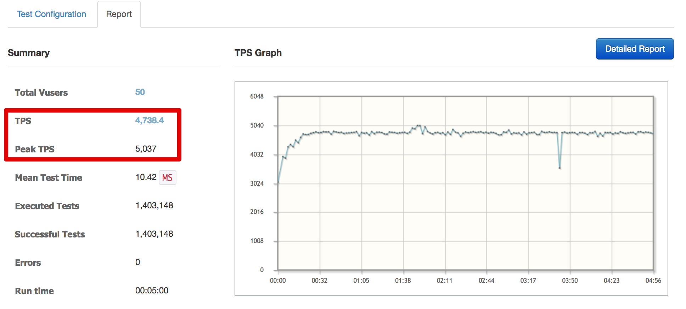
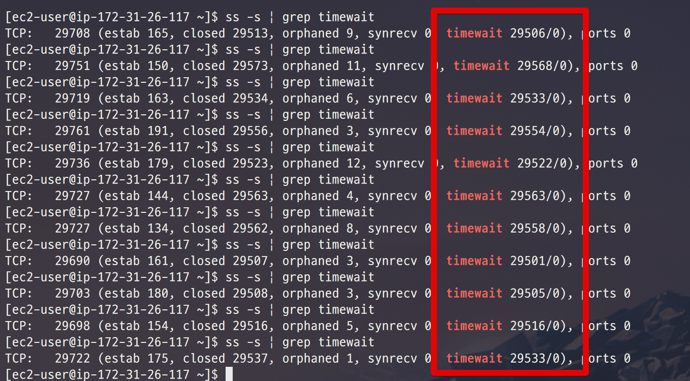
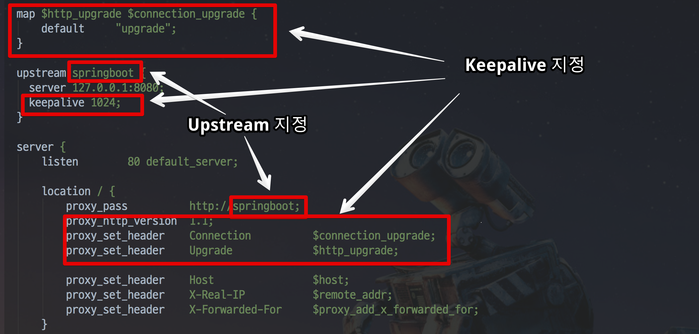
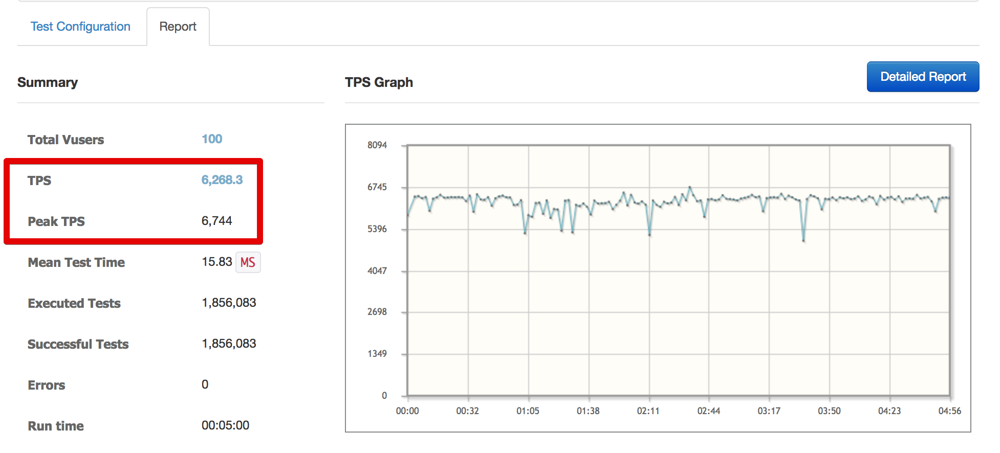
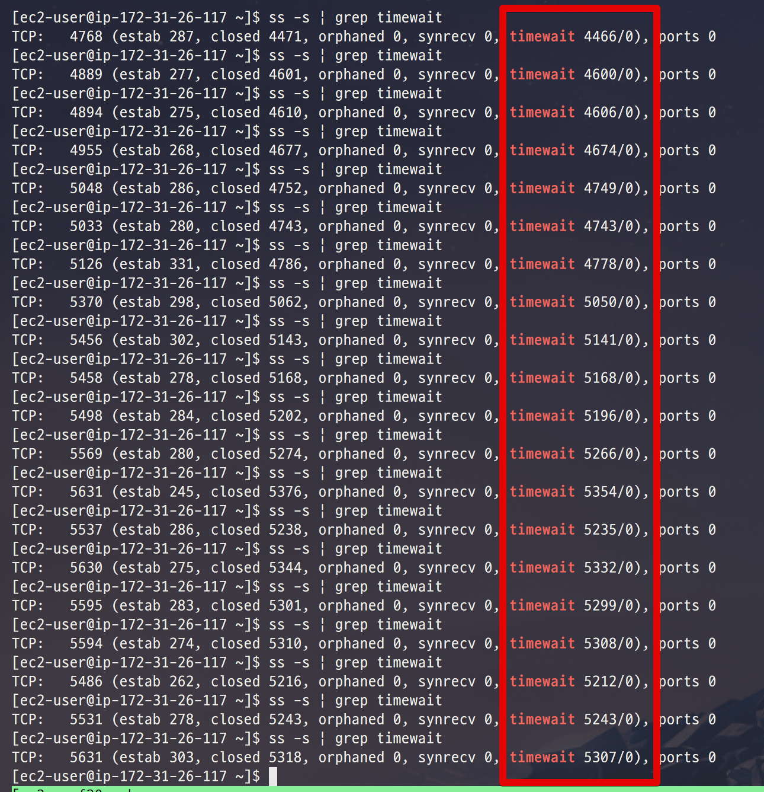

# 3. Nginx 튜닝

[지난 시간](http://jojoldu.tistory.com/319)에 보셨던것처럼 **AWS Elastic Beanstalk은 기본적으로 Nginx을 갖고 있습니다**.  
이 내용을 모르시는 분들 입장에선 성능 튜닝시 Nginx 부분은 놓치실 수 있는데요.  
그래서 이번 시간에는 Nginx와 Spring Boot 간의 성능 튜닝 과정을 진행해보겠습니다.

## 3-1. 여전히 많은 time_wait 소켓

지난 시간에 ```net.ipv4.tcp_tw_reuse``` 값을 수정하여 로컬 포트 고갈 문제를 해결하였습니다!  
그리고 수정된 버전으로 다시 한번 성능 테스트를 진행했는데요.  
  


Vuser 50으로 맞추고 테스트를 하니 TPS가 4700까지 올라갔습니다!  
한번더 성능 테스트를 하던 중 timewait 소켓을 체크해봤더니! 



대략 **3만개의 timewait 소켓이 생성되어 유지중** 이였습니다.  

### 3-1-1. upstream keepalive 소개

## 3-2. Nginx와 Spring Boot간의 keepalive 설정


## 3-3. AWS Beanstalk의 Nginx 설정하기 


AWS Beanstalk에서 Nginx의 nginx.conf 파일을 수정하는 방법은 간단합니다.  


> Beanstalk 배포시에 .ebextensions 디렉토리와 jar 를 포함시키는게 어려우신 분들은 [이전에 작성된 포스팅](http://jojoldu.tistory.com/317)을 참고해보세요!








## 3-4. epoll


```
모든 것이 리눅스의 파일이기 때문에 네트워크 연결조차 파일 내부적입니다.  
모든 프로세스마다 유니크한 File Descriptor가 있습니다.  
이 File Descriptor는 어느 것이 읽거나 쓸 준비가되었는지를 식별하기 위해 자주 폴링해야합니다 (nginx 서버가 수신하는 짝수 연결은 nginx 프로세스가 파일 형식으로 유지 관리합니다 연결의 수명에 대한 설명자).

 

앞서 논의한 것처럼 nginx는 단일 스레드로 비 차단 I / O를 사용합니다. 따라서 단일 프로세스는 어떤 연결 파일을 읽거나 쓸 준비가되었는지 식별해야합니다. 이를 위해 운영 체제에는 세 가지 방법이 있습니다. 아래에 언급되어 있습니다.

 

방법 선택
설문 조사 방법
Epoll 방법
 

select와 poll을 모두 사용하면 어떤 파일 설명자가 준비되었는지를 식별하는 효율적인 방법이 아닙니다. 이 두 가지 방법은 모두 똑같기 때문에 (select와 epoll의 차이점을 설명 할만큼 충분히 능력이 없다. 프로그래머라면 select와 poll에 대해 더 알고 싶으면 아래 링크를 클릭하는 것이 좋다.)

 

읽기 : 선택 및 설문

 

따라서 nginx는 select 또는 poll 메소드를 사용하여 어떤 파일 (파일 디스크립터)이 읽히거나 쓰여질 준비가되었는지 확인할 수있다. 그러나이 두 가지 방법 모두 너무 많은 연결 수가있을 때 충분히 효율적이지 않습니다. 예를 들어 한 번에 10000 개의 연결을 제공한다고 가정합니다. 그리고 그들 중 하나만 읽을 준비가되었습니다. 하나의 파일 디스크립터가 읽을 준비가되었음을 확인하기 위해 프로세스는 나머지 9999 파일 디스크립터 (자원 낭비)를 계속 스캔해야한다.

 

select와 Poll 이외의 또 다른 방법은 epoll 이 여기에서 구하려고 온다. 이것은 2.6 이후의 Linux 커널에서만 사용 가능합니다. Epoll은 투표 및 선택에 비해 효율적인 메커니즘을 사용합니다.

 

서버에 10000 개의 연결이 있고 그 중 8000 개가 유휴 연결 인 경우 poll과 select를 사용하는 것은 효과적이지 않습니다. 왜냐하면 epoll은 활성화 된 연결에만 중요성을 부여하기 때문입니다. 모든 세 가지 선택, 설문 조사 및 epoll은 기본적으로 같은 일을하지만 epoll을 사용하면 수천 개의 연결을 제공해야 할 때 CPU 사용량이 줄어 듭니다. 


```

## 3-5. worker_connections

```bash
top 
```

## 참고

* [nginx-web-server-performance-tuning-how-to-do-it](https://www.slashroot.in/nginx-web-server-performance-tuning-how-to-do-it)
* [nginx upstream 성능 최적화](https://brunch.co.kr/@alden/11)
* [DevOps와 SE를 위한 리눅스 커널 이야기](https://book.naver.com/bookdb/book_detail.nhn?bid=12343450)