# 4. 기타

자 이번 시간엔 이 시리즈에서 자세히 다루진 않지만, 꼭 해야할 여러 설정 포인트를 정리하겠습니다.  

## 4-1. Open Files

예를 들어 ```@Async``` 혹은 ```CompletableFuture``` 와 같은 비동기 쓰레드를 많이 사용해야하거나, 
응답시간이 오래 걸리는 외부 API 요청이 대량으로 발생하는 경우 등등 대규모 트래픽 서비스에서 자주 발생하는 것이 ```Too many open files``` 에러입니다.  
 
> 좀 더 자세한 내용은 이전에 작성한 [Java, max user processes, open files](http://woowabros.github.io/experience/2018/04/17/linux-maxuserprocess-openfiles.html) 를 참고해보세요!  
**EC2, IDC 에서의 설정 방법이 해당 포스트 최하단**에 있습니다.

위 이슈 등으로 인해 기본적으로 Linux 서버에 설정해줘야하는 값이 바로 **Open Files** 입니다.  
AWS Beanstalk 에서도 마찬가지로 이 값을 설정 할 수 있습니다.  
[2번째 시간](http://jojoldu.tistory.com/319)에서 사용했던 ```.ebextension/00-system-tuning.config``` 파일을 활용합니다.

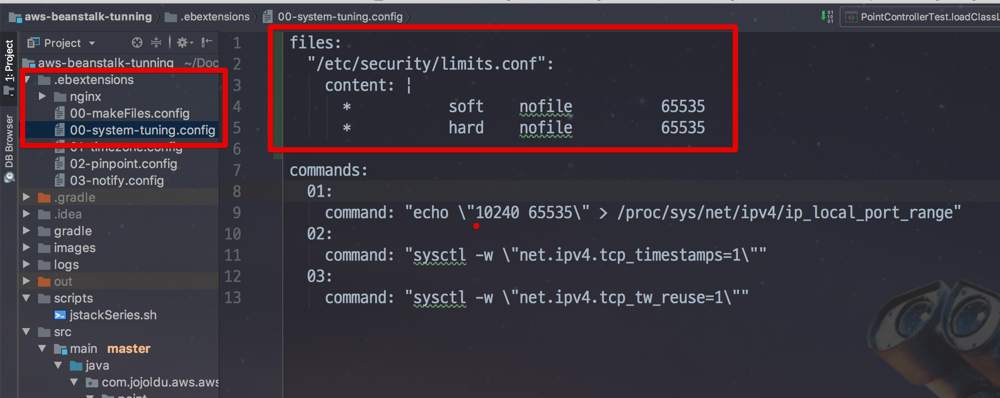

```bash
files:
  "/etc/security/limits.conf":
    content: |
      *           soft    nofile          65535
      *           hard    nofile          65535

```

자 이렇게 설정하셨다면 배포하기전에 잠시 **현재 open files** 값을 확인합니다.

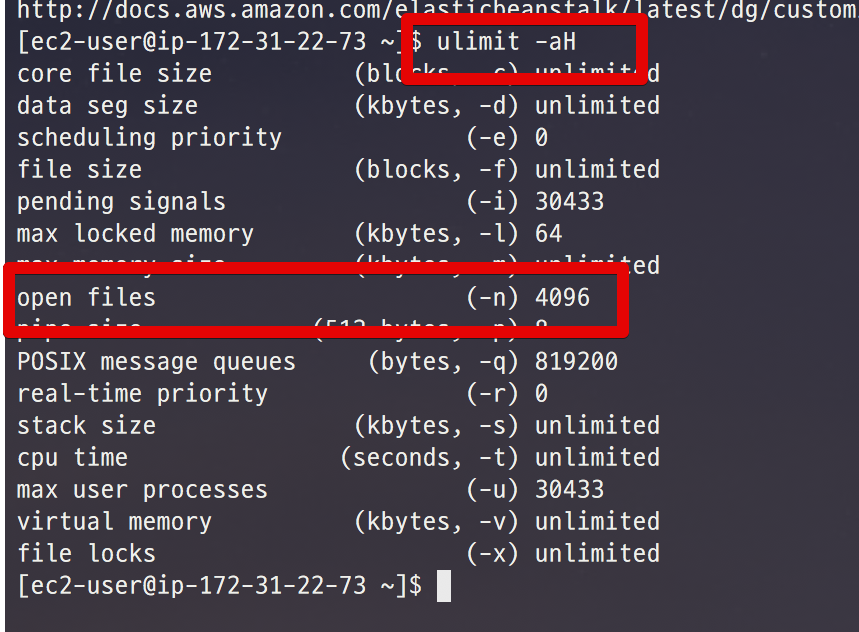

현재 4096이며, 배포를 진행해보시면!

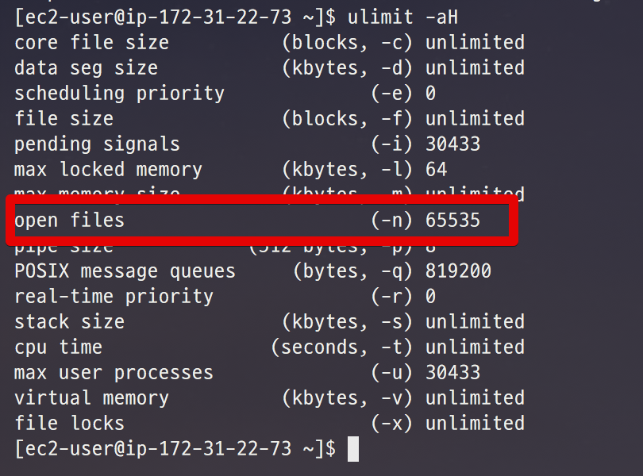

이렇게 65535 값으로 변경된것을 알 수 있습니다!

## 4-2. tcp_max_tw_buckets

다음으로 변경해볼 값은 ```net.ipv4.tcp_max_tw_buckets``` 입니다.  
이 값은 **시스템이 동시에 가질수 있는 timewait 소켓의 최대 개수**입니다.  
이 값을 초과하면 time-wait 소켓을 즉시 파괴하고 경고를 출력합니다.  
  
이 값은 성능 테스트 결과에 맞춰 높이셔도 되는데요.  
**기본값보다 낮추시면 안됩니다**

현재 수치를 확인하는 방법은 아래 명령어로 가능합니다.

```bash
cat /proc/sys/net/ipv4/tcp_max_tw_buckets
```

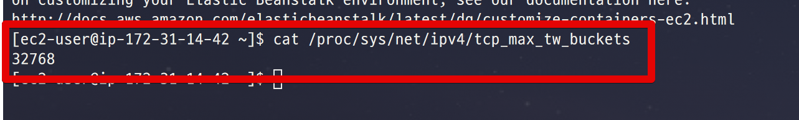


아래 명령어를 사용하면 적용되니, EC2나 IDC에서 사용합니다.

```bash
echo "net.ipv4.tcp_max_tw_buckets=2000000" >> /etc/sysctl.conf
```

숫자에 오타가 발생할수 있기 위해 말씀드리자면 **200만**입니다.  
추가로 위 설정을 **서버에 영구 설정**하기 위해 아래 명령어를 실행합니다.

```bash
sysctl -p
```

Beanstalk의 설정은 4-1에서 진행했던것과 마찬가지로 ```.ebextension/00-system-tuning.config``` 파일을 이용합니다.

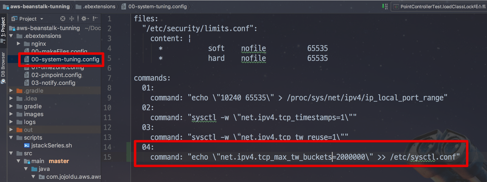

```bash
files:
  "/etc/security/limits.conf":
    content: |
      *           soft    nofile          65535
      *           hard    nofile          65535

commands:
  01:
    command: "echo \"10240 65535\" > /proc/sys/net/ipv4/ip_local_port_range"
  02:
    command: "sysctl -w \"net.ipv4.tcp_timestamps=1\""
  03:
    command: "sysctl -w \"net.ipv4.tcp_tw_reuse=1\""
  04:
    command: "echo \"net.ipv4.tcp_max_tw_buckets=2000000\" >> /etc/sysctl.conf"
  10:
    command: "sysctl -p"
```

config 파일 설정후 배포를 해보시면!

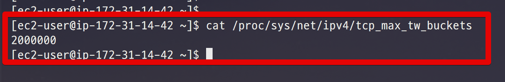

이렇게 설정값이 변경된 것을 확인할 수 있습니다!


### 커널 파라미터 가이드

이 외에도 정말 많은 **리눅스 커널 파라미터 가이드가** 있습니다.  
제가 주로 참고하는 2개 사이트인데요.  
다른분들도 이 문서들을 보면서 성능 테스트를 진행해보셨으면 합니다.

* [Linux - 레드헷과 수세리눅스에서 사용하는 네트워크 관련 커널변수](https://support.hpe.com/hpsc/doc/public/display?docId=emr_na-c01418125)  

* [시스템 엔지니어 공동 관리 구역](http://blog.syszone.co.kr/m/634)

## 4-3. Nginx

Nginx 가이드는 [이전 시간](http://jojoldu.tistory.com/322)에 Keepalive를 소개드렸는데요.  
이외에도 여러 튜닝 포인트가 있습니다.  
아래 링크는 제가 참고한 2개 사이트인데요.  
설명이 정말 친절합니다.  
하나씩 값을 변경해보시면서 적용해보시길 추천드립니다.

* [NGINX Tuning For Best Performance](https://gist.github.com/denji/8359866)

* [nginx-web-server-performance-tuning-how-to-do-it](https://www.slashroot.in/nginx-web-server-performance-tuning-how-to-do-it)

## 4-4. RDS

AWS RDS 에서 설정할 수 있는 옵션들 2개만 소개드립니다.  

> 나머지는 최하단 링크를 통해 직접 테스트해보시면서 최적의 값을 찾아보세요!

### 4-4-1. Max Connections

RDS의 경우 RDS 사양에 맞춰 max_connections 이 자동으로 결정됩니다.  

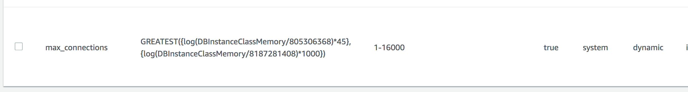

계산 방법은 간단합니다.  
만약 해당 RDS를 사용하는 서버가 5대이고, **각 서버가 DB Connection Pool을 100으로 잡고 있다면 RDS에서 필요한 max_connections는 최소 500** (```100*5```) 입니다.  
여분으로 1000 ~ 2000정도를 더 잡으면 되니 대략 1500 ~ 2500이 되겠죠?  

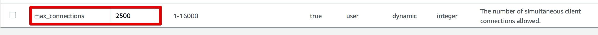

### 4-4-2. Query Cache

[아르노 Adant 가 MySQL Connect 2013 에서 발표한 성능개선 50가지 팁](http://aadant.com/blog/wp-content/uploads/2013/09/50-Tips-for-Boosting-MySQL-Performance-CON2655.pdf)에서 나온 내용인데요.  

**query_cache 옵션을 off** 하는 것입니다.  

> 쿼리 캐쉬 옵티마이져 Single Thread 동작방식이라 Bottle Lack 자주 걸린다고 합니다.

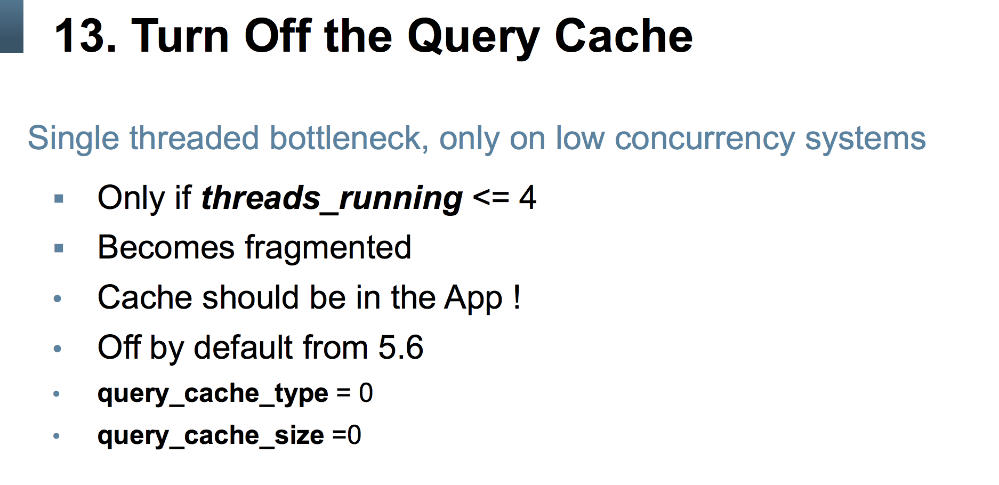

(PPT 1)

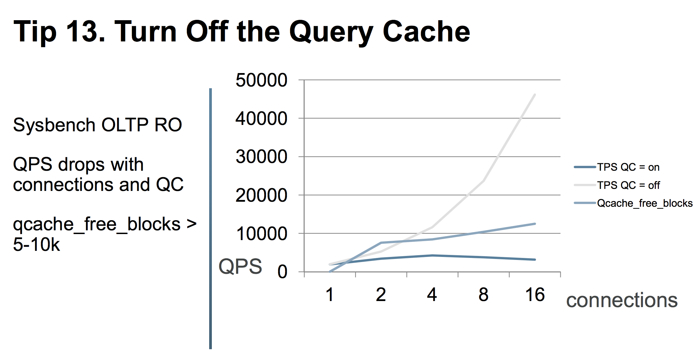

(PPT 2)

> 물론 직접 **부하 테스트, 하루 ~ 이틀동안 계속해서 트래픽을 주는 등 여러 테스트**를 실험해봐야합니다.  
**저희 팀에선 해당 옵션을 off한 경우 성능이 더 잘나와** 현재 off 해서 사용중입니다.


다행히 RDS 파라미터 그룹에서 해당 옵션을 조정할 수가 있어 아래처럼 변경하시면 됩니다.

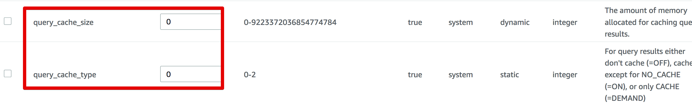

### RDS 파라미터 튜닝 참고 사이트

이 외에도 많은 RDS 파라미터 튜닝 방법들이 있습니다만,  
제가 DB 전문가가 아니다보니 ㅠ  
여러분들이 직접 서비스 상황에 맞게 성능 테스트를 하면서 조정할 수 밖에 없습니다.  
그래도 조금의 가이드가 있으면 작업하시기 편할것 같아 참고하는 사이트들을 소개합니다.

* [아르노 Adant 가 MySQL Connect 2013 에서 발표한 성능개선 50가지 팁](http://aadant.com/blog/wp-content/uploads/2013/09/50-Tips-for-Boosting-MySQL-Performance-CON2655.pdf)
* [나는 프로그래머다! - DB 튜닝의 모든 것](http://ncrash.github.io/subway-study/2016/12/23/iamprogrammer-db-tuning-chapter1.html)
* [Amazon RDS Performance Tuning Settings](https://gist.github.com/douglasjarquin/2208690)

## 4-5. 후기

드디어! 성능 튜닝 시리즈가 끝났습니다!  
회사에서 레거시 개편을 진행하면서 AWS 인프라를 담당하게 됐습니다.  
진행하면서 누가 좀 하나씩 이 설정값이 어떤 역할이고 설정 안하면 어떻게 된다를 자세하게 가르쳐줬으면 좋겠다는 생각을 계속 했습니다.  
그래서 이 시리즈가 저처럼 인프라나 성능 이슈가 어색하신 분들께 도움이 되었으면 합니다.  
여튼!  
긴 시리즈 끝까지 봐주셔서 너무 감사합니다!  
다음에도 좋은 시리즈물 준비해서 공유하겠습니다. :)
