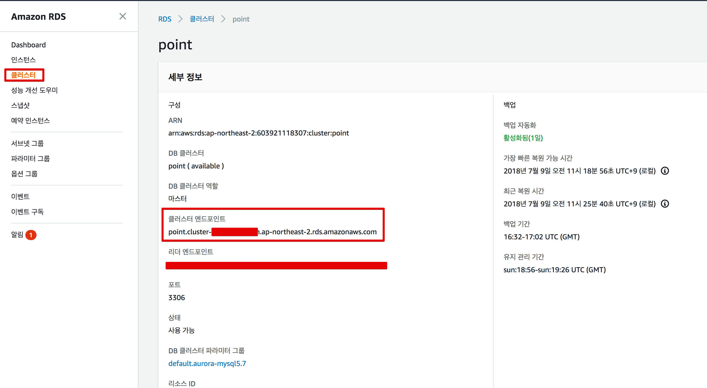

# AWS Beanstalk 성능 튜닝 시리즈

* AWS Beanstalk
* AWS Aurora RDS
    * AWS와 같은 클라우드 환경에 최적화
    * [AWS Aurora 도입전에 알아야 할 몇가지 사실](https://medium.com/hbsmith/aws-aurora-%EB%8F%84%EC%9E%85%EC%97%90-%EB%8C%80%ED%95%9C-%EB%AA%87%EA%B0%80%EC%A7%80-%EC%82%AC%EC%8B%A4-45eb602bad58) 참고
    * 테스트에선 **r4.large** 사용
* Spring Boot
* [Pinpoint](https://github.com/naver/pinpoint)
    * 네이버에서 만든 APM (어플리케이션 모니터링)
* [nGrinder](https://github.com/naver/ngrinder)
    * 네이버에서 만든 스트레스 테스트 플랫폼
    * [설치가이드](https://github.com/naver/ngrinder/wiki/Installation-Guide)

Pinpoint와 nGrinder의 설치는 이미 되어있는 상태라 가정하고 진행합니다.  

> 성능 개선에 좀 더 초점을 맞춰서 진행하겠습니다.

## 기본 환경 구성

* SPRING_DATASOURCE_HIKARI_JDBC-URL
    * ```jdbc:mariadb:aurora://Aurora클러스터엔드포인트:포트/DB```
* SPRING_DATASOURCE_HIKARI_USERNAME
* SPRING_DATASOURCE_HIKARI_PASSWORD



## TIME_WAIT 소켓 최적화

### 
## keepalive 개선

## 소켓 재사용 활성화


## RDS -> Redis 전환