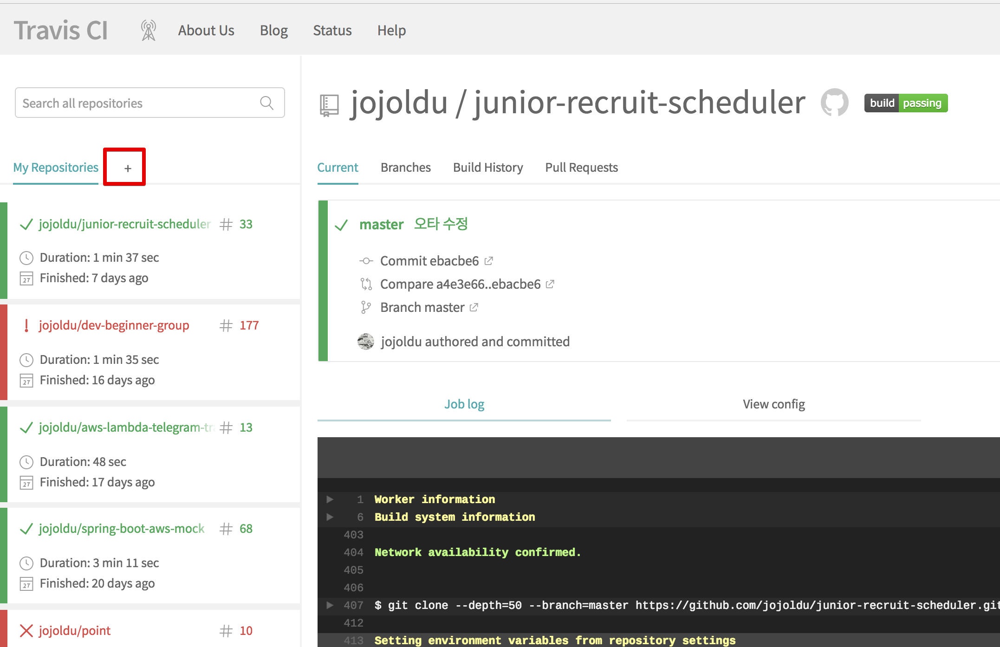

# Travis CI와 AWS ElasticBeanstalk 연동하기




```yaml
language: java
jdk:
  - openjdk8

branches:
  only:
    - master

# Travis CI 서버의 Home
cache:
  directories:
    - '$HOME/.m2/repository'
    - '$HOME/.gradle'

script: "./gradlew clean build"

# 배포에 필요한 파일들만 archive 에 옮겨서 deploy/archive.zip 파일로 만든다.
before_deploy:
  - mkdir -p archive && mkdir -p deploy
  - cp build/libs/*.jar archive/
  - cp -r .ebextensions/ archive/.ebextensions
  - cd archive
  - zip -r archive *

deploy:
  provider: elasticbeanstalk
  zip_file: archive/archive.zip
  access_key_id: $AWS_ACCESS_KEY # declared in Travis repo settings
  secret_access_key:
    secure: $AWS_SECRET_KEY
  region: "ap-northeast-2"
  app: "dwlee-beanstalk"
  env: "beanstalk-performance-tunning"
  bucket_name: "dwlee-beanstalk"  # S3 bucket name
  on:
    branch: master

after_deploy:
  - echo "Elastic Beanstalk 배포 진행중입니다."

after_success:
  - echo "배포 성공"

notifications:
  webhooks: https://fathomless-fjord-24024.herokuapp.com/notify

```