# Travis CI와 AWS ElasticBeanstalk 연동하기

안녕하세요?  
이번 시간에는 Travis CI를 이용하여 Spring Boot를 AWS Beanstalk에 배포하는 과정을 소개드리겠습니다.  
모든 내용은 [Github](https://github.com/jojoldu/aws-beanstalk-tunning)에 있기 때문에 코드를 참고하시면 도움이 되실것 같습니다.  
  
AWS에서는 heroku와 같은 일체형 서비스를 지원하고 있습니다.  
그게 바로 AWS ElasticBeanstalk인데요.  
EC2처럼 하나하나 설정할 필요없이 웬만한 기능들은 다 자동화 되기도 하고, 추가 설정들은 config 파일로 해결할 수 있어서 빠르게 구축할 수 있는 장점이 있습니다.  
  
만약 개인 프로젝트를 AWS ElasticBeanstalk에 구축한다면 Travis CI와 함께 이용하시면 젠킨스나 Code Pipeline등을 별도로 구축할 필요 없이 편하게 개발 환경이 완성됩니다.  
  
그럼 본문을 시작하겠습니다!

## 1. IAM User 생성

가장 먼저 할 일은 Travis CI에서 사용할 Key를 생성하는 것 입니다.  

> AWS 외에 다른 서비스에서 혹은 물리서버에서 AWS 서비스를 사용할때는 항상 해당 기능의 권한을 갖고 있는 사용자를 생성하여 해당 사용자의 access key와 secret key를 사용해야만 합니다.

먼저 AWS IAM 서비스로 접속하여 **사용자 추가**를 클릭합니다.

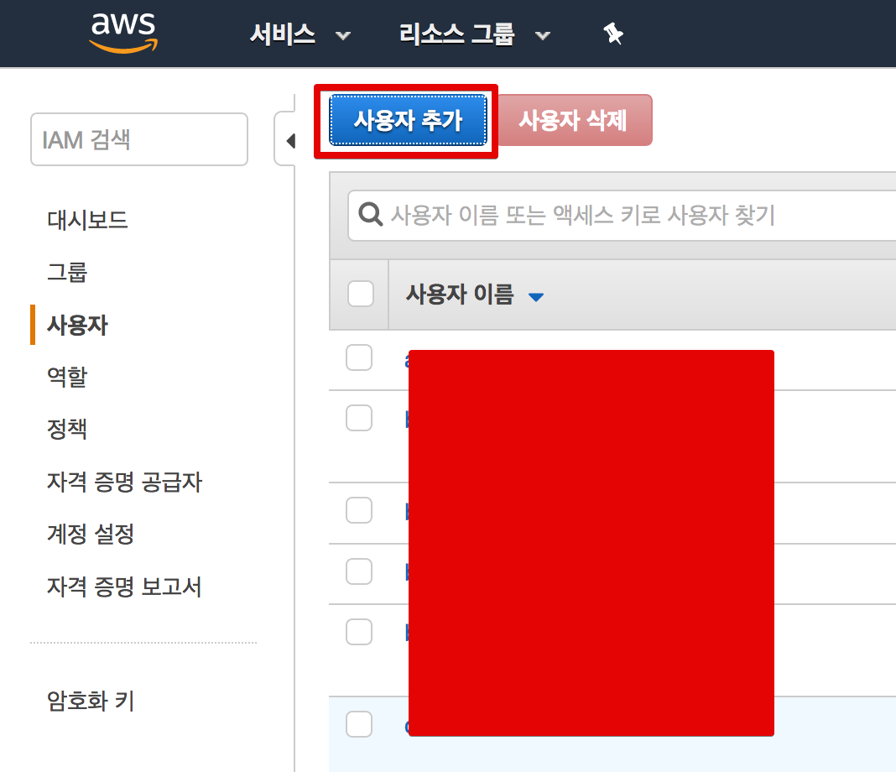

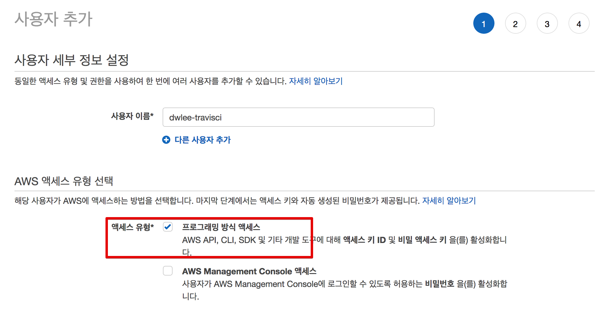

정책은 2가지를 선택하시면 되는데요.

* Elastic Beanstalk Full Access
* S3 Full Access

Travis CI에서는 Elastic Beanstalk에 파일을 바로 전송할 수 있는 방법이 없어서 S3를 통해서 전송해야 합니다.  
그래서 S3 접근 권한이 필요하니 잊지 말고 S3도 추가 하셔야 합니다.

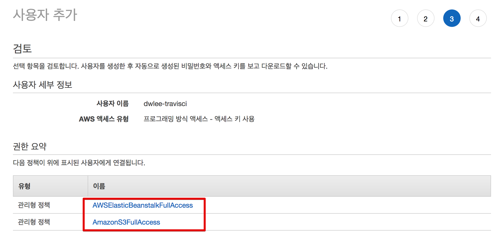

생성이 되시면 access key (엑세스키) 와 secret key (비밀 엑세스 키)가 발급됩니다.

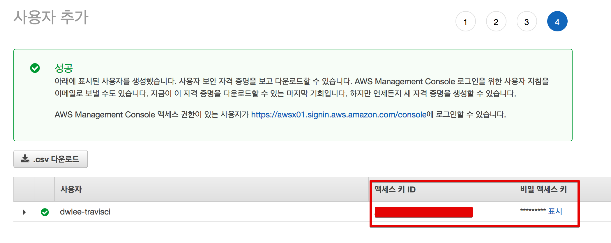

Travis CI에서 사용해야하니 별도로 메모하시면 됩니다.

## 2. Travis CI에 등록하기  

IAM User가 생성되었으니 바로 Travis CI에 연동해보겠습니다.  
[travis ci](https://travis-ci.org/)에 접속을 하시고 좌측 하단의 Repository 추가 (+) 버튼을 클릭합니다.


연동하고자 하는 프로젝트를 활성화 시키고

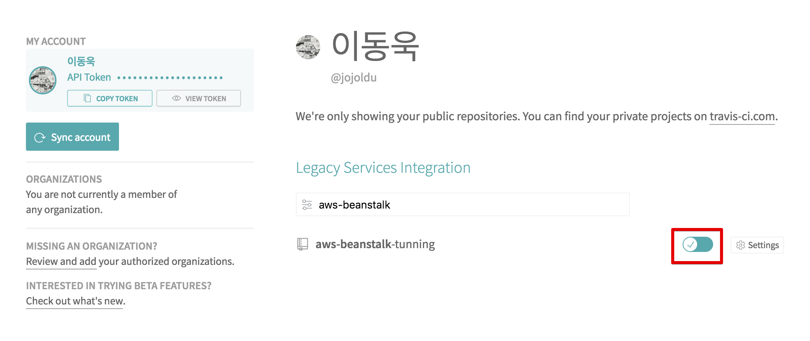

연동된 프로젝트 페이지로 가보시면 아무것도 없는 빈 화면이 나옵니다.  
해당 화면의 우측 상단을 보시면 **More options** 버튼이 있는데요.  
버튼을 클릭하시고 **Settings** 을 클릭합니다.

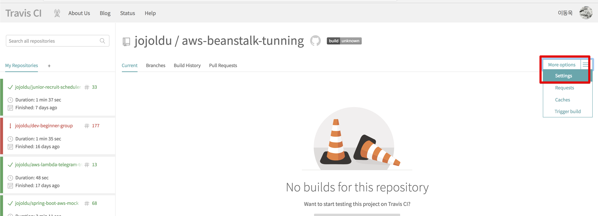

그럼 아래와 같이 환경 변수를 입력할 수 있는 화면이 나오는데요.  
**Environment Variables** 항목에 IAM User의 access key와 secret key를 등록합니다.

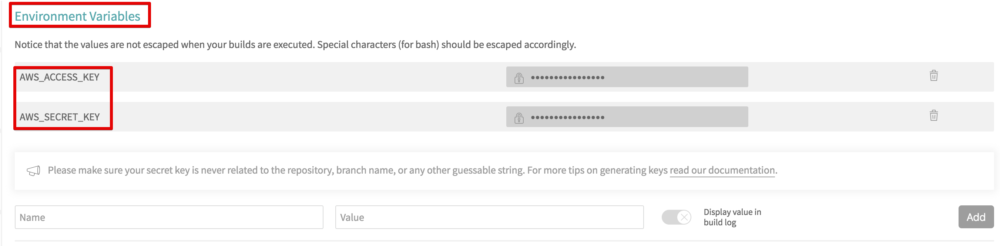

* ```AWS_ACCESS_KEY```
    * access key값을 입력합니다.
* ```AWS_SECRET_KEY```
    * secret key값을 입력합니다.

자 이렇게 하면 Travis CI에서의 작업도 끝이 났습니다!  
바로 프로젝트 설정으로 넘어가겠습니다.

## 3. 프로젝트 설정

프로젝트에서 해야할 일은 한가지입니다.  
Travis CI의 배포를 정의할 ```.travis.yml``` 파일을 생성하는 것입니다.  
프로젝트 폴더 안에 ```.travis.yml```을 생성합니다.

```yaml
language: java
jdk:
  - openjdk8

branches:
  only:
    - master

# Travis CI 서버의 Home
cache:
  directories:
    - '$HOME/.m2/repository'
    - '$HOME/.gradle'

script: "./gradlew clean build"

# 배포에 필요한 파일들만 archive 에 옮겨서 archive/archive.zip 파일로 만든다.
before_deploy:
  - mkdir -p archive
  - cp build/libs/*.jar archive/application.jar
  - cp -r ./.ebextensions archive/.ebextensions
  - cd archive
  - ls -al
  - zip -r archive.zip application.jar .ebextensions

deploy:
  provider: elasticbeanstalk
  zip_file: archive.zip # before_deploy에서 이미 archive로 이동한 상태(cd archive)라 현재 위치에서 archive.zip 전송
  skip_cleanup: true
  access_key_id: $AWS_ACCESS_KEY # declared in Travis repo settings
  secret_access_key:
    secure: $AWS_SECRET_KEY
  region: "ap-northeast-2"
  app: "dwlee-beanstalk"
  env: "beanstalk-performance-tunning"
  bucket_name: "dwlee-beanstalk"  # S3 bucket name
  on:
    branch: master

after_deploy:
  - echo "Elastic Beanstalk 배포 진행중입니다."

notifications:
  webhooks: https://fathomless-fjord-24024.herokuapp.com/notify

```

yml의 내용 중 대부분은 쉽게 이해가 가실것 같습니다.  
before_deploy 스크립트를 보면 ```cp -r ./.ebextensions archive/.ebextensions```로 ```.ebextensions```를 복사하는데요.  
이건 아래 5번 과정에서 소개할 Beanstalk config 파일들을 배포 시점에 모두 같이 배포한다는 의미입니다.  

여기서 ```deploy.app```과 ```deploy.env```는 Beanstalk의 값들입니다.

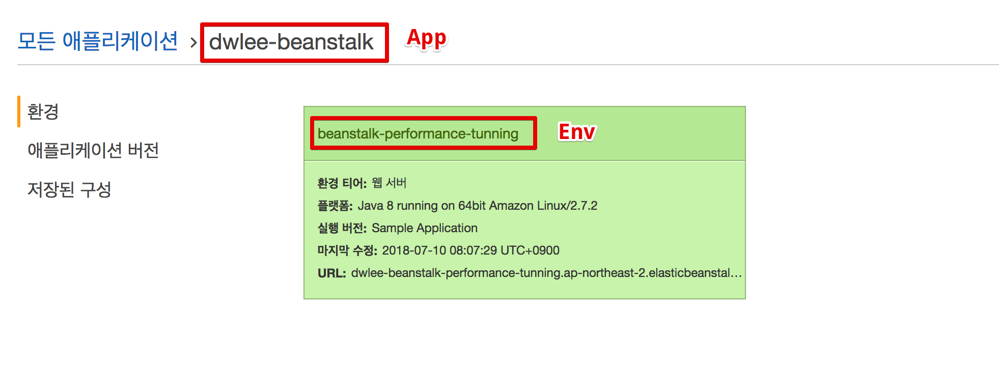

추가로 ```deploy.bucket_name```이 있는데요, 이건 미리 생성해둔 S3 bucket 이름을 얘기합니다.  
저는 미리 생성해둔 bucket이 있어 그대로 사용했구요. 만약 없으시다면 생성하셔서 그 이름을 등록하시면 됩니다.

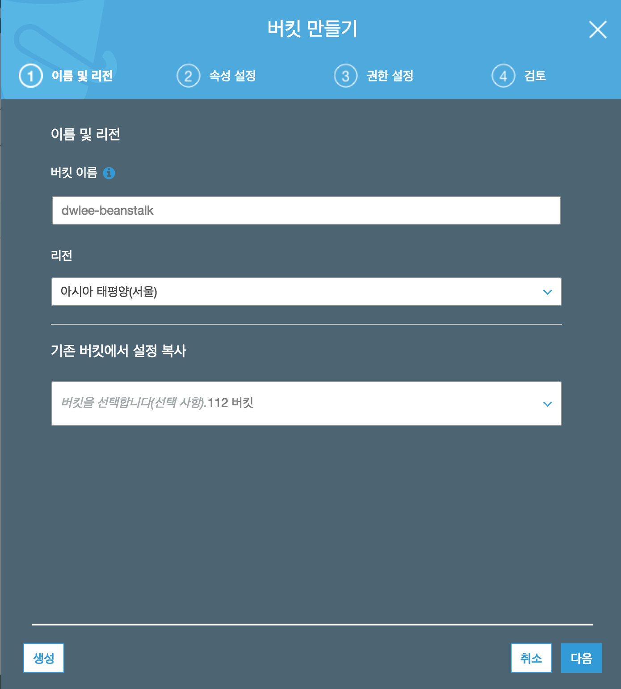

자 이렇게 설정이 다 끝나셨다면 한번 배포를 시작해보겠습니다.

## 4. 배포 확인

작업 내용을 Github에 push 하시면

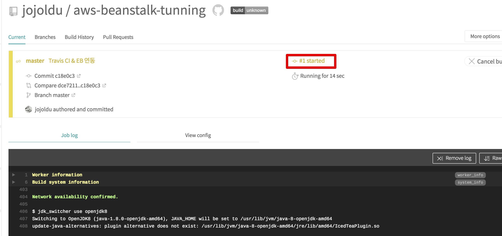

이렇게 Travis가 자동으로 배포가 시작됩니다.  
Travis CI 작업이 끝나면 바로 Beanstalk의 배포가 시작됩니다.


그럼 이렇게 배포가 성공적으로 끝났음을 확인할 수 있습니다!

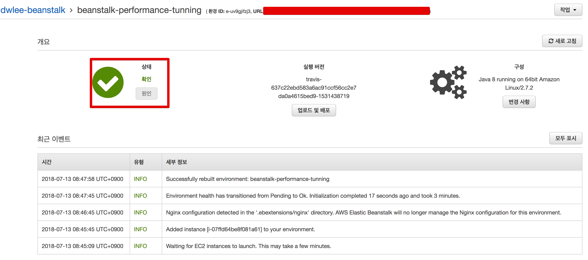

## 5. Beanstalk 추가 설정이 필요하다면?

Beanstalk의 경우 EC2처럼 일일이 설정이 필요하지 않습니다만, 그럼에도 추가 설정이 필요할때가 있습니다.  
그때는 config 파일을 통해서 설정을 진행하면 되는데요.  
여기서는 간단하게 Beanstalk의 타임존을 UTC -> KST로 변경하는 설정을 추가하겠습니다.  
  
현재 서버 시간은 UTC로 나옵니다.

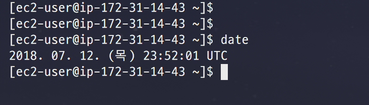

폴더에 ```.ebextensions``` 폴더를 만들고, 그 안에 ```01-timezone.config``` 파일을 생성합니다.

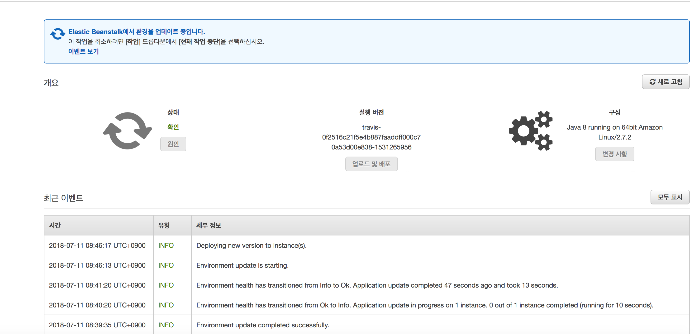

```
commands:
  01remove_local:
    command: "rm -rf /etc/localtime"
  02link_seoul_zone:
    command: "ln -s /usr/share/zoneinfo/Asia/Seoul /etc/localtime"
```

이렇게 추가후 다시 배포를 진행해보시면!

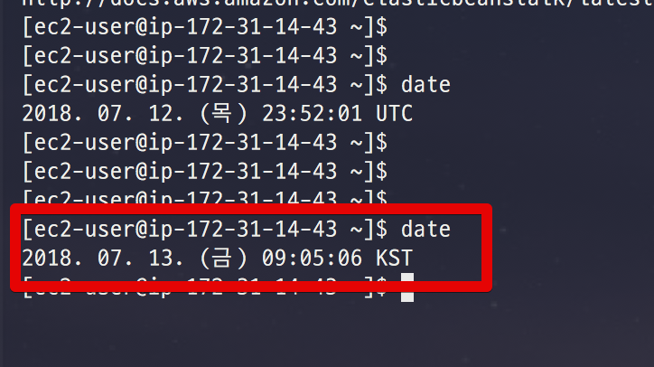

별도의 서버 설정 없이 서버 타임존이 UTC -> KST로 변경된것을 알 수 있습니다.

## 마무리

Github에 push될때마다 Beanstalk이 자동 배포되고, 배포 될때 서버 환경을 ```.ebextensions``` 안의 config 파일을 통해서 자동 설정되는 환경이 구축되었습니다!  
혹시나 개인 프로젝트를 빠르고 편하게 사용하실 분들이 계신다면 꼭 참고하시면 좋을것 같습니다


